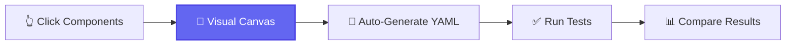
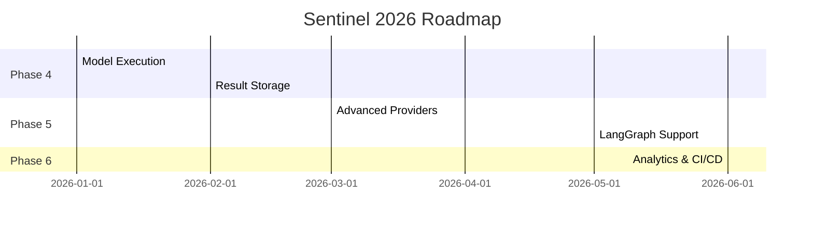

<div align="center">

<picture>
  <source media="(prefers-color-scheme: dark)" srcset="assets/sentinel-square-abstract-transparent.png">
  <source media="(prefers-color-scheme: light)" srcset="assets/sentinel-square-abstract-transparent.png">
  
</picture>

# Sentinel

### Visual-First AI Agent Testing Platform

**"Point, Click, Test" — Make AI agent testing as intuitive as Postman made API testing**

[](https://github.com/navam-io/sentinel/releases)
[](LICENSE)
[](frontend/src/)
[](metrics/latest.md)
[](https://www.typescriptlang.org)
[](https://react.dev)
[](https://www.python.org)

[Quick Start](#-quick-start) • [Features](#-key-features) • [Documentation](#-documentation) • [Roadmap](#-roadmap) • [Contributing](#-contributing)

</div>

---

## 🎯 What is Sentinel?

**Sentinel** is a **visual-first testing and evaluation platform** for AI agents, designed for frontier AI labs, research teams, and agent builders. Build tests with an intuitive **drag-and-drop canvas** or write declarative **YAML** specs—your choice.

<div align="center">



</div>

### Why Sentinel?

<table>
<tr>
<td width="33%" align="center">

### 🎨 **Visual First**
Build tests by clicking, not coding. No YAML knowledge required.

</td>
<td width="33%" align="center">

### 🔄 **Git Friendly**
Visual changes = clean YAML diffs. Perfect for version control and CI/CD.

</td>
<td width="33%" align="center">

### 🧪 **Research Grade**
Built for frontier AI labs with deterministic, repeatable testing.

</td>
</tr>
</table>

> **Target Positioning**: "Postman for AI Agents" with research-grade rigor and visual-first design

---

## ✨ Key Features

### Current Release (v0.22.0 - November 23, 2025)

<table>
<tr>
<td width="50%">

#### 🎨 **Visual Canvas & Library**
<sup>React 19 • React Flow 12.3 • Tauri 2.0</sup>

- ✅ **Unified Library Tab**: Templates + user tests in one interface
- ✅ **12-Category System**: Q&A, Code Gen, Browser Agents, Multi-turn, Safety, and more
- ✅ **16 Built-in Templates**: Production-ready test templates
- ✅ **6+ Node Types**: Input, Model, Assertion, Tool, System, Output
- ✅ **Real-time YAML** generation from canvas
- ✅ **Smart Positioning** with auto-layout
- ✅ **Desktop App** (Tauri 2.0) for local-first workflow
- ✅ **473 Unit Tests** (100% pass rate)

</td>
<td width="50%">

#### 🔧 **Type-Safe Backend & Execution**
<sup>FastAPI • Pydantic • Python 3.13</sup>

- ✅ **8 Assertion Types** (text, regex, tools, format, perf)
- ✅ **Round-Trip Conversion** (Visual ↔ YAML, zero data loss)
- ✅ **Schema Validation** with clear error messages
- ✅ **Backend Tests** with comprehensive coverage
- ✅ **Model Providers**: Anthropic Claude, OpenAI GPT-5
- ✅ **FastAPI Backend** with SQLite/PostgreSQL support
- ✅ **Type Safety**: Black, Ruff, MyPy, TypeScript strict mode
- ✅ **Test Suites** with folder organization

</td>
</tr>
</table>

### 🧪 Test Coverage & Quality

<div align="center">

| Category | Metric | Status |
|----------|--------|--------|
| **Frontend Unit Tests** | 473 tests across 27 test files | ✅ 100% passing |
| **Frontend Coverage** | Component, hooks, services, stores | ✅ 50%+ coverage |
| **Backend Tests** | pytest suite with comprehensive coverage | ✅ 85%+ coverage |
| **TypeScript Strict Mode** | 0 errors, only 4 `any` usages | ✅ Excellent type safety |
| **Code Quality** | Black, Ruff, MyPy, ESLint | ✅ All checks pass |
| **Total Codebase** | 57,581 LOC (project code only) | ✅ Well-documented (47% docs) |

</div>

<details>
<summary><b>📦 Tech Stack Details</b></summary>

#### Frontend
- **Framework**: React 19 + Vite 6.0
- **Desktop**: Tauri 2.0 (Rust-powered desktop app)
- **Canvas**: React Flow 12.3 (@xyflow/react)
- **State**: Zustand 5.0
- **Styling**: TailwindCSS + shadcn/ui
- **Testing**: Vitest + React Testing Library
- **Type Safety**: TypeScript 5.7 (strict mode, 0 errors)
- **Icons**: lucide-react

#### Backend
- **API**: FastAPI 0.115+
- **Schema**: Pydantic v2 (type-safe validation)
- **Database**: SQLite (local) / PostgreSQL (server)
- **Testing**: pytest + pytest-cov
- **Code Quality**: Black (line-length: 100), Ruff, MyPy
- **Python**: 3.13+

#### Model Providers (Pluggable)
- **Anthropic API**: Claude 3.5 Sonnet, Claude 3 Opus (≥0.43.1)
- **OpenAI API**: GPT-5.1 (default), GPT-5 Pro, GPT-5 Mini (≥1.59.6)
- **Future**: Amazon Bedrock, HuggingFace, Ollama

</details>

---

## 🚀 Quick Start

### Option 1: Visual Canvas (Desktop App) — Recommended ⭐

```bash
# Clone repository
git clone https://github.com/navam-io/sentinel.git
cd sentinel/frontend

# Install dependencies
npm install

# Launch desktop app (hot reload enabled)
npm run tauri:dev
```

**🎉 That's it!** The visual canvas opens with:
- Component palette on the left
- Interactive canvas in the center
- Library tab with 16+ templates
- Test suite organizer

**Try it now:**
1. Click **Library** tab → Browse 16 built-in templates
2. Click **Load** on any template → Canvas populates automatically
3. Click **Canvas** tab → See visual node representation
4. Click **Test** tab → View auto-generated YAML
5. Click **Run Test** → Execute and see live results!

<details>
<summary><b>Option 2: Development Mode (Browser Only)</b></summary>

```bash
cd frontend
npm install
npm run dev  # Opens http://localhost:1420
```

Runs Vite dev server without Tauri. Faster for UI-only development.

</details>

<details>
<summary><b>Option 3: Backend API (Python)</b></summary>

```bash
# Setup Python environment
cd backend
python3 -m venv venv
source venv/bin/activate  # Windows: venv\Scripts\activate

# Install dependencies
pip install -e ".[dev]"

# Run tests to verify
pytest -v  # ✅ All tests pass

# Start API server (optional)
uvicorn main:app --reload
# Visit http://localhost:8000/docs for API documentation
```

</details>

---

## 🎬 Visual Canvas Demo

### Building Your First Test in 60 Seconds

<table>
<tr>
<td width="25%" align="center">

**1. Browse Library**
<br><br>
📚 16+ templates
<br>
12 categories
<br>
Search & filter

</td>
<td width="25%" align="center">

**2. Load Template**
<br><br>
👁️ Click "Load"
<br>
Canvas auto-populates
<br>
Nodes connected

</td>
<td width="25%" align="center">

**3. Customize**
<br><br>
✏️ Edit node values
<br>
Add/remove nodes
<br>
Real-time YAML sync

</td>
<td width="25%" align="center">

**4. Run & Validate**
<br><br>
▶️ Execute test
<br>
Live results
<br>
Pass/fail indicators

</td>
</tr>
</table>

### Generated YAML Example

```yaml
# Auto-generated from visual canvas
name: "Geography Quiz"
version: "1.0"
description: "Test factual knowledge about world capitals"
category: "qa"

model:
  provider: "openai"
  model: "gpt-5.1"
  temperature: 0.7
  max_tokens: 1000

inputs:
  - type: "input"
    query: "What is the capital of France?"

assertions:
  - type: "must_contain"
    value: "Paris"
  - type: "output_type"
    value: "text"
  - type: "max_latency_ms"
    value: 2000

tags:
  - "canvas-generated"
  - "geography"
  - "qa-test"
```

---

## 💡 12-Category Test Classification

<table>
<tr>
<td width="33%">

### 📝 **Q&A Testing**
<sup>Blue • Knowledge validation</sup>

Test factual knowledge and basic reasoning

```yaml
category: "qa"
assertions:
  - must_contain: "Paris"
  - max_latency_ms: 2000
```

**Use Cases:**
- Knowledge validation
- Fact-checking
- Simple reasoning

</td>
<td width="33%">

### 💻 **Code Generation**
<sup>Purple • Syntax validation</sup>

Validate code structure and quality

```yaml
category: "code-generation"
assertions:
  - regex_match: "def\\s+\\w+"
  - output_type: "code"
```

**Use Cases:**
- Code quality checks
- Syntax validation
- Function detection

</td>
<td width="33%">

### 🌐 **Browser Agents**
<sup>Green • Web automation</sup>

Test browser interactions and scraping

```yaml
category: "browser-agents"
assertions:
  - must_call_tool: ["browser"]
  - output_type: "json"
```

**Use Cases:**
- Web scraping tests
- UI automation
- Browser tool usage

</td>
</tr>
<tr>
<td width="33%">

### 🔄 **Multi-turn**
<sup>Orange • Conversations</sup>

Multi-step dialogue testing

```yaml
category: "multi-turn"
assertions:
  - must_contain: "context"
  - min_tokens: 50
```

**Use Cases:**
- Conversation flows
- Context retention
- Multi-step reasoning

</td>
<td width="33%">

### 🔗 **LangGraph**
<sup>Cyan • Agentic workflows</sup>

Test LangGraph state machines

```yaml
category: "langgraph"
assertions:
  - must_call_tool: ["state"]
  - output_type: "json"
```

**Use Cases:**
- Workflow testing
- State management
- Agent coordination

</td>
<td width="33%">

### 🛡️ **Safety**
<sup>Red • Security testing</sup>

Security and safety validation

```yaml
category: "safety"
assertions:
  - must_not_contain: "sensitive"
  - output_type: "text"
```

**Use Cases:**
- Prompt injection tests
- Content safety
- Security validation

</td>
</tr>
</table>

<details>
<summary><b>📚 See All 12 Categories</b></summary>

<br>

| Category | Color | Purpose | Example Use Cases |
|----------|-------|---------|-------------------|
| **Q&A** | Blue | Knowledge & reasoning tests | Fact-checking, trivia, simple Q&A |
| **Code Generation** | Purple | Code quality validation | Syntax checks, function detection, code structure |
| **Browser Agents** | Green | Web automation testing | Scraping, UI testing, browser tools |
| **Multi-turn** | Orange | Conversation flows | Dialogue testing, context retention |
| **LangGraph** | Cyan | Agentic workflows | State machines, workflow orchestration |
| **Safety** | Red | Security & safety | Prompt injection, content filtering |
| **Data Analysis** | Indigo | Data processing tasks | CSV parsing, data transformation |
| **Reasoning** | Pink | Logic & problem-solving | Chain-of-thought, math, puzzles |
| **Tool Use** | Yellow | Function calling tests | API calls, tool invocation |
| **API Testing** | Teal | REST endpoint validation | HTTP requests, API responses |
| **UI Testing** | Lime | Visual & interaction tests | Component rendering, user flows |
| **Regression** | Amber | Consistency testing | Version comparison, behavior stability |

</details>

<details>
<summary><b>📚 See All 8 Assertion Types</b></summary>

<br>

| Type | Purpose | Example | Use Case |
|------|---------|---------|----------|
| `must_contain` | Text presence check | `"Paris"` | Verify specific content appears |
| `must_not_contain` | Text absence check | `"London"` | Ensure unwanted content absent |
| `regex_match` | Pattern matching | `"def\\s+\\w+"` | Validate code/format structure |
| `must_call_tool` | Tool verification | `["browser", "calculator"]` | Verify agent tool usage |
| `output_type` | Format validation | `"json"`, `"code"`, `"text"` | Enforce output format |
| `max_latency_ms` | Performance check | `2000` | Ensure response time < 2s |
| `min_tokens` | Min output length | `50` | Require minimum detail |
| `max_tokens` | Max output length | `500` | Enforce conciseness |

</details>

---

## 📖 Documentation

<table>
<tr>
<td width="50%">

### 🚀 **Getting Started**
- [Installation Guide](docs/getting-started.md) - Setup in 5 minutes
- [Visual Canvas Guide](docs/visual-canvas.md) - Build tests visually
- [Quick Start Tutorial](docs/quick-start.md) - Your first test
- [Code Metrics Report](metrics/latest.md) - Comprehensive codebase analysis

### 📚 **Examples & Templates**
- [16 Built-in Templates](templates/) - Production-ready examples
- [Example Walkthroughs](docs/examples.md) - Detailed guides
- [12 Test Categories](docs/categories.md) - Classification guide

</td>
<td width="50%">

### 📘 **API Reference**
- [DSL Reference](docs/dsl-reference.md) - Complete YAML spec
- [Python API Docs](docs/api-reference.md) - Backend API
- [Schema Reference](docs/schema-reference.md) - Pydantic models

### 🔧 **Advanced**
- [Best Practices](docs/best-practices.md) - Writing effective tests
- [CI/CD Integration](docs/ci-cd.md) - Automation guide
- [Architecture Guide](CLAUDE.md) - Technical deep-dive

</td>
</tr>
</table>

---

## 🗺️ Roadmap

### ✅ **Recently Released**

<details open>
<summary><b>v0.22.0 - Unified Library Tab & 12-Category System</b> (Nov 23, 2025) ⭐ Latest</summary>

<br>

**Major UX Improvements & Template Expansion**

#### Library Tab & Category System
- ✅ Unified Library Tab combining templates and user tests
- ✅ 12-Category Classification System (Q&A, Code Gen, Browser, Multi-turn, Safety, etc.)
- ✅ 10 New Templates (API Testing, Data Analysis, LangGraph, Safety, Reasoning, etc.)
- ✅ Enhanced search and filtering
- ✅ Category-based organization with color coding

#### UI/UX Improvements
- ✅ Tab restructure: Canvas, Test, Suite, Library
- ✅ Integrated run section in Test tab (collapsible)
- ✅ State persistence (run details, suite expansion)
- ✅ Refined LibraryCard component with icons
- ✅ Better visual hierarchy and information design

#### Backend Enhancements
- ✅ Database schema updates (category, is_template fields)
- ✅ Updated API endpoints for category management
- ✅ Test renaming functionality

</details>

<details>
<summary><b>v0.21.0 - Test Suite Organizer</b> (Nov 22, 2025)</summary>

<br>

- ✅ Test suite organizer with folders
- ✅ Suite search and filtering
- ✅ Drag-and-drop test organization
- ✅ Suite export/import

</details>

<details>
<summary><b>v0.20.0 - Enhanced Visual Canvas</b> (Nov 2025)</summary>

<br>

- ✅ Test renaming functionality
- ✅ Improved drag-drop palette
- ✅ Auto-save improvements
- ✅ Better YAML synchronization

</details>

### 🚧 **In Progress**

<div align="center">



</div>

<table>
<tr>
<td width="33%">

**v0.23.0 - Execution**
<sup>Q1 2026</sup>

- Live execution dashboard
- Result storage (SQLite)
- Test run history
- Metrics & analytics
- Performance tracking

</td>
<td width="33%">

**v0.24.0 - Providers**
<sup>Q1 2026</sup>

- Bedrock integration
- HuggingFace support
- Ollama local models
- Provider comparison
- Cost tracking

</td>
<td width="33%">

**v0.25.0 - LangGraph**
<sup>Q2 2026</sup>

- LangGraph framework support
- State machine testing
- Multi-agent workflows
- Workflow visualization
- Debug tools

</td>
</tr>
</table>

<details>
<summary><b>🔮 Future Features (v0.26.0+)</b></summary>

<br>

**Advanced Features (Q2-Q3 2026)**
- **v0.26.0**: AI-assisted test generation
- **v0.27.0**: Visual assertion builder enhancements
- **v0.28.0**: Regression engine & comparison view

**Enterprise Features (Q3-Q4 2026)**
- **v0.29.0**: Collaborative workspaces
- **v0.30.0**: Advanced safety scenarios
- **v0.31.0**: Dashboard & analytics platform
- **v0.32.0**: CI/CD integration & automation

**[→ Full roadmap with detailed specs](backlog/active.md)**

</details>

---

## 👥 Who Uses Sentinel?

<table>
<tr>
<td width="50%">

### 🎯 **Primary Users**
**Visual-First Interface**

- 📊 **Product Managers** - Validate agents without code
- 🔬 **Research Scientists** - Build evaluation suites visually
- 🧪 **QA Engineers** - Create and debug tests with clicks
- 🛡️ **Safety Teams** - Collaborative safety testing
- 🏢 **Frontier Labs** - Test model releases
- 🧬 **Neo-labs** - Agent-focused research

</td>
<td width="50%">

### ⚡ **Advanced Users**
**DSL Mode + Programmatic**

- 💻 **Model Engineers** - Direct YAML editing, programmatic tests
- ⚙️ **DevOps Engineers** - CI/CD integration, automation
- 🏗️ **Infrastructure Teams** - Enterprise testing at scale
- 🤖 **Agent Builders** - Production validation
- 🔧 **Framework Developers** - Integration testing
- 📈 **MLOps Teams** - Regression detection

</td>
</tr>
</table>

---

## 📊 Project Stats

<div align="center">

| Metric | Value | Metric | Value |
|--------|-------|--------|-------|
| **Version** | 0.22.0 | **Release Date** | Nov 23, 2025 |
| **Total Tests** | 473 passing | **Test Pass Rate** | 100% ✅ |
| **Frontend Tests** | 27 files, 473 tests | **Backend Tests** | 6 files, comprehensive coverage |
| **Frontend Coverage** | 50%+ | **Backend Coverage** | 85%+ |
| **Node Types** | 6+ production | **Templates** | 16 ready-to-use |
| **Categories** | 12 classifications | **Assertion Types** | 8 validators |
| **Frontend LOC** | 13,536 (100 files) | **Backend LOC** | 3,234 (34 files) |
| **TypeScript Errors** | 0 (strict mode) | **TypeScript `any`** | Only 4 instances |
| **Components** | 68 React components | **Documentation** | 27,157 LOC (47% of codebase) |

**Tech Metrics:**
- **Build Time**: ~3s (Vite HMR)
- **Desktop App**: Tauri 2.0 (lightweight, fast startup)
- **Test Execution**: 2.24s for 473 unit tests
- **Type Safety**: TypeScript strict mode, Pydantic v2

**Code Quality:**
- ✅ **Frontend**: ESLint, TypeScript strict (0 errors)
- ✅ **Backend**: Black (line-length: 100), Ruff, MyPy
- ✅ **Codebase**: 57,581 LOC (project code only, excluding dependencies)
- ✅ **Documentation**: Exceptional (47.2% of codebase is documentation)

</div>

---

## 🤝 Contributing

We welcome contributions! Sentinel is in active development and we'd love your help.

<table>
<tr>
<td width="33%" align="center">

### 🐛 **Report Bugs**
[GitHub Issues](https://github.com/navam-io/sentinel/issues)

Found a bug? Let us know!

</td>
<td width="33%" align="center">

### 💡 **Suggest Features**
[Discussions](https://github.com/navam-io/sentinel/discussions)

Have ideas? Start a discussion!

</td>
<td width="33%" align="center">

### 📖 **Improve Docs**
[Submit PRs](https://github.com/navam-io/sentinel/pulls)

Help make docs better!

</td>
</tr>
</table>

### Development Setup

```bash
# Backend Development
cd backend
python3 -m venv venv
source venv/bin/activate  # Windows: venv\Scripts\activate
pip install -e ".[dev]"

# Run backend tests
pytest -v --cov=backend
black . && ruff check . && mypy .

# Frontend Development
cd frontend
npm install

# Run frontend tests
npm test                    # Unit tests (Vitest) - 473 tests
npm run lint                # ESLint
npm run type-check          # TypeScript (0 errors)

# Run dev server
npm run dev                 # Browser only
npm run tauri:dev           # Desktop app (recommended)

# Code quality checks
npm run lint && npm run type-check
```

<details>
<summary><b>📋 Contributing Guidelines</b></summary>

<br>

**How to Contribute:**

1. **Fork** the repository
2. **Create** a feature branch (`git checkout -b feature/amazing-feature`)
3. **Commit** your changes (`git commit -m 'Add amazing feature'`)
4. **Push** to the branch (`git push origin feature/amazing-feature`)
5. **Open** a Pull Request

**Code Style:**
- **Frontend**: ESLint + TypeScript strict mode (0 errors required)
- **Backend**: Black (line-length: 100) + Ruff + MyPy
- **Tests**: Required for all features (unit tests where applicable)
- **Commits**: Conventional Commits format (`feat:`, `fix:`, `docs:`, etc.)

**Testing Requirements:**
- Unit tests for all new components/functions
- 100% test pass rate before merge
- No TypeScript errors allowed
- Maintain or improve test coverage

**Review Process:**
- All PRs require 1 approval
- CI/CD checks must pass (tests, linting, type checking)
- Documentation updates for new features

</details>

---

## 🎨 Design Principles

<table>
<tr>
<td width="25%" align="center">

### 🎯 **Visual First**
<br>
GUI is primary interface
<br>
DSL for interoperability

</td>
<td width="25%" align="center">

### 🔒 **Security First**
<br>
Desktop-first architecture
<br>
Self-hosted, air-gapped support

</td>
<td width="25%" align="center">

### 🔬 **Research Grade**
<br>
Deterministic & reproducible
<br>
Built for frontier AI labs

</td>
<td width="25%" align="center">

### ♿ **Accessible**
<br>
No coding required
<br>
Everyone can test agents

</td>
</tr>
</table>

**Core Philosophy**: "Point, Click, Test"

> Make AI agent testing as intuitive as Postman made API testing, as visual as Langflow made LLM workflows, and as powerful as LangSmith made observability.

---

## 🙏 Acknowledgments

Sentinel's design is inspired by industry-leading tools:

<table>
<tr>
<td width="20%" align="center">

**[Langflow](https://github.com/logspace-ai/langflow)**
<br><br>
Node-based LLM workflows
<br>
Visual-first design

</td>
<td width="20%" align="center">

**[n8n](https://github.com/n8n-io/n8n)**
<br><br>
Visual automation
<br>
Drag-and-drop UX

</td>
<td width="20%" align="center">

**[Postman](https://www.postman.com/)**
<br><br>
API testing UX
<br>
Developer experience

</td>
<td width="20%" align="center">

**[Playwright](https://playwright.dev/)**
<br><br>
Record/replay pattern
<br>
E2E testing

</td>
<td width="20%" align="center">

**[LangSmith](https://www.langchain.com/langsmith)**
<br><br>
LLM observability
<br>
Evaluation platform

</td>
</tr>
</table>

**Special Thanks:**
- **React Flow** team for production-ready canvas library
- **Tauri** team for lightweight desktop framework
- **shadcn/ui** for beautiful component library
- Open source community for inspiration and support

---

## 📄 License

**MIT License** - see [LICENSE](LICENSE) file for details.

```
Copyright (c) 2025 Navam

Permission is hereby granted, free of charge, to any person obtaining a copy
of this software and associated documentation files (the "Software"), to deal
in the Software without restriction, including without limitation the rights
to use, copy, modify, merge, publish, distribute, sublicense, and/or sell
copies of the Software, and to permit persons to whom the Software is
furnished to do so, subject to the following conditions:

The above copyright notice and this permission notice shall be included in all
copies or substantial portions of the Software.

THE SOFTWARE IS PROVIDED "AS IS", WITHOUT WARRANTY OF ANY KIND, EXPRESS OR
IMPLIED, INCLUDING BUT NOT LIMITED TO THE WARRANTIES OF MERCHANTABILITY,
FITNESS FOR A PARTICULAR PURPOSE AND NONINFRINGEMENT.
```

---

## 💬 Community & Support

<div align="center">

[](docs/)
[](metrics/latest.md)
[](https://github.com/navam-io/sentinel/issues)
[](https://github.com/navam-io/sentinel/discussions)
[](https://twitter.com/navam_io)

</div>

### 📧 Contact

- **Email**: hello@navam.io
- **Twitter**: [@navam_io](https://twitter.com/navam_io)
- **GitHub**: [navam-io/sentinel](https://github.com/navam-io/sentinel)
- **Website**: [navam.io](https://navam.io)

---

<div align="center">

### 🚀 Current Status

**Version**: 0.22.0 (Released November 23, 2025)<br>
**Status**: Unified Library Tab with 12-Category System ✅<br>
**Next Milestone**: v0.23.0 - Model Execution & Result Storage (Q1 2026)

**Production Ready Features:**
- ✅ Visual canvas with 6+ node types
- ✅ Real-time Visual ↔ YAML synchronization
- ✅ Library with 16 categorized templates
- ✅ 12-category classification system
- ✅ Test suite organizer
- ✅ Desktop app (Tauri 2.0)
- ✅ 473 tests with 100% pass rate
- ✅ Comprehensive documentation (47% of codebase)

---

**[⬆ Back to Top](#sentinel)**

Built with ❤️ by the [Navam Team](https://navam.io) for frontier AI labs, researchers, and agent builders

**⭐ Star this repo if you find it helpful!**

</div>
