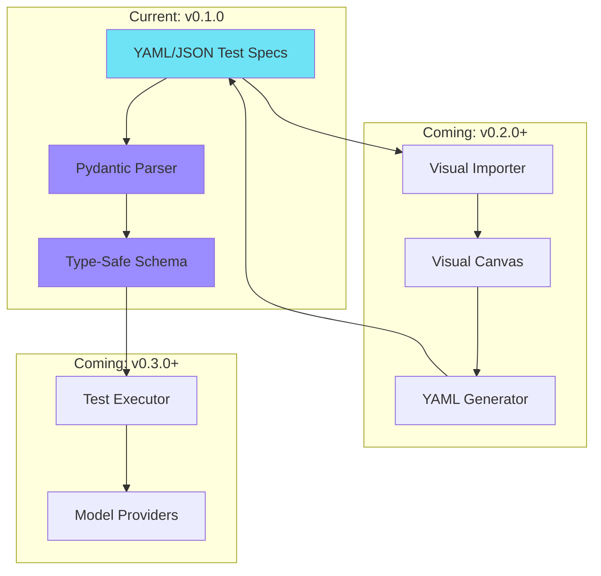

<div align="center">

# 🛡️ Sentinel

**Visual-first agent testing and evaluation platform for AI labs**

[](https://github.com/navam-io/sentinel/releases)
[](LICENSE)
[](https://www.python.org)
[](tests/)
[](tests/)

[Quick Start](#-quick-start) •
[Features](#-features) •
[Documentation](#-documentation) •
[Examples](#-examples) •
[Roadmap](#-roadmap)

</div>

---

## 🎯 What is Sentinel?

Sentinel is a **visual-first agent testing platform** that makes AI agent testing as intuitive as Postman made API testing. Build tests with a drag-and-drop canvas, or write YAML directly—your choice.

**Current Release (v0.3.0)**: React-based visual canvas with production-ready drag-and-drop, 5 node types, real-time YAML generation, and Tauri desktop app.

### Core Philosophy

> **"Point, Click, Test"** - Visual-first interface with round-trip DSL generation

Sentinel makes AI agent testing accessible to everyone—from product managers to model engineers—through an intuitive approach backed by a powerful YAML-based DSL for version control and CI/CD.

---

## ✨ Features

### Current (v0.3.0) ✅

<table>
<tr>
<td width="33%">

**🎨 Visual Canvas (React)**
- Tauri 2.0 desktop app
- React Flow (production-ready)
- 100% reliable drag-and-drop
- Real-time YAML generation
- **5 node types**: Input, Model, Assertion, Tool, System
- Component palette
- YAML preview with edit/copy/download
- Bidirectional Visual ↔ DSL sync

</td>
<td width="33%">

**🔧 DSL Schema & Parser**
- Pydantic-based type-safe schema
- YAML/JSON parsing with validation
- Round-trip conversion (zero data loss)
- 8 assertion types supported
- Complete error messages
- Visual → YAML generator
- YAML → Visual importer

</td>
<td width="33%">

**📦 Production Ready**
- 70 tests, 98% coverage
- 6 example templates included
- Python API for programmatic access
- React 19 + Vite + Zustand
- Sentinel design system (TailwindCSS 4.0)
- Comprehensive documentation

</td>
</tr>
</table>

### Coming Soon 🚀

<table>
<tr>
<td width="33%">

**🔄 Monaco Editor Integration**
*(v0.4.0)*

- Advanced YAML editing
- Syntax highlighting
- Auto-completion
- Split view mode

</td>
<td width="33%">

**⚡ Test Execution**
*(v0.5.0)*

- Anthropic & OpenAI providers
- Local execution engine
- Live metrics dashboard
- Result storage

</td>
<td width="33%">

**🔍 Regression Detection**
*(v0.6.0+)*

- Visual comparison view
- Metric deltas
- Trend analysis
- Automated alerts

</td>
</tr>
</table>

---

## 🚀 Quick Start

### Option 1: Visual Canvas (Recommended)

**Requirements**: Node.js 18+ and Rust (for Tauri)

```bash
# Clone the repository
git clone https://github.com/navam-io/sentinel.git
cd sentinel/frontend

# Install dependencies
npm install

# Run desktop app (development mode)
npm run tauri:dev
```

**That's it!** The visual canvas will open, and you can:
1. Drag nodes from the left palette onto the canvas
2. Connect nodes to build your test flow
3. See real-time YAML generation on the right
4. Export your test to a .yaml file

### Option 2: DSL/Code-First

**Requirements**: Python 3.10+

```bash
# Clone the repository
git clone https://github.com/navam-io/sentinel.git
cd sentinel

# Create virtual environment
python -m venv venv
source venv/bin/activate  # Windows: venv\Scripts\activate

# Install dependencies
pip install -r backend/requirements.txt

# Verify installation
pytest tests/ -v
# ✓ 70 tests passed, 98% coverage
```

**Create a test** (`my_test.yaml`):

```yaml
name: "Simple Q&A Test"
model: "gpt-4"
inputs:
  query: "What is the capital of France?"
assertions:
  - must_contain: "Paris"
  - output_type: "text"
tags:
  - geography
```

**Parse and validate**:

```python
from backend.core.parser import TestSpecParser

spec = TestSpecParser.parse_file("my_test.yaml")
print(f"✓ Test loaded: {spec.name}")
```

**🎉 Choose your style** - Visual or Code, both work perfectly!

---

## 📚 Documentation

<table>
<tr>
<td width="50%">

### Getting Started
- **[Installation Guide](docs/getting-started.md)** - Setup and first steps
- **[Quick Start](docs/getting-started.md#quick-start)** - Create test in 5 minutes
- **[Examples](docs/examples.md)** - 6 template walkthroughs

</td>
<td width="50%">

### Reference
- **[DSL Reference](docs/dsl-reference.md)** - Complete specification
- **[API Reference](docs/api-reference.md)** - Python API docs
- **[Best Practices](docs/best-practices.md)** - Guidelines & patterns

</td>
</tr>
</table>

---

## 💡 Examples

### Example 1: Simple Q&A

```yaml
name: "Capital Cities Q&A"
model: "gpt-4"
seed: 123

inputs:
  query: "What is the capital of Japan?"
  system_prompt: "Answer accurately and concisely."

assertions:
  - must_contain: "Tokyo"
  - output_type: "text"
  - max_latency_ms: 2000
```

### Example 2: Code Generation

```yaml
name: "Python Function Generation"
model: "claude-3-5-sonnet-20241022"

inputs:
  query: "Write a Python function to calculate fibonacci numbers"

assertions:
  - must_contain: "def"
  - must_contain: "fibonacci"
  - regex_match: "def\\s+\\w+\\([^)]*\\):"
  - output_type: "code"
```

### Example 3: Browser Agent

```yaml
name: "Product Research Agent"
model: "claude-3-5-sonnet-20241022"
tools:
  - browser
  - scraper
  - calculator

inputs:
  query: "Find top 3 laptops under $1000"

assertions:
  - must_call_tool: ["browser"]
  - must_contain: "price"
  - output_type: "json"
```

### Example 4: Test Suite

```yaml
name: "E-commerce Test Suite"
version: "1.0.0"

defaults:
  model: "claude-3-5-sonnet-20241022"
  provider: "anthropic"
  timeout_ms: 30000

tests:
  - name: "Product search"
    inputs:
      query: "Find laptops under $1000"
    assertions:
      - must_contain: "price"

  - name: "Product comparison"
    inputs:
      query: "Compare top 2 gaming laptops"
    assertions:
      - must_contain: "comparison"
```

**[→ See all 6 templates](templates/)** with detailed explanations in [docs/examples.md](docs/examples.md)

---

## 🏗️ Architecture



### Tech Stack

<table>
<tr>
<td width="50%">

**Current (v0.1.0)**
- **Schema**: Pydantic v2
- **Parser**: PyYAML
- **Testing**: pytest, pytest-cov
- **Validation**: Type-safe with clear errors

</td>
<td width="50%">

**Planned (v0.2.0+)**
- **Desktop**: Tauri 2.0 (Rust)
- **Frontend**: SvelteKit + TypeScript
- **Canvas**: React Flow
- **API**: FastAPI + Python

</td>
</tr>
</table>

---

## 🎯 What Can You Build?

### Supported Test Types

| Test Type | Description | Example |
|-----------|-------------|---------|
| **Q&A Testing** | Factual knowledge validation | Geography, math, general knowledge |
| **Code Generation** | Validate generated code structure | Functions, classes, algorithms |
| **Tool-Using Agents** | Test agent tool interactions | Browser, calculator, search |
| **Multi-Turn Conversations** | Context retention testing | Customer support, chat |
| **Framework Agents** | LangGraph, Claude SDK, etc. | Research agents, workflows |
| **Performance Testing** | Latency and token thresholds | Speed benchmarks |

### Assertion Types (8 Supported)

```python
# Text matching
{"must_contain": "Paris"}
{"must_not_contain": "London"}

# Pattern matching
{"regex_match": "def\\s+\\w+\\([^)]*\\):"}

# Tool validation
{"must_call_tool": ["browser", "calculator"]}

# Format validation
{"output_type": "json"}  # json, text, markdown, code, structured

# Performance
{"max_latency_ms": 2000}
{"min_tokens": 50, "max_tokens": 500}
```

---

## 📊 Project Stats

<div align="center">

| Metric | Value |
|--------|-------|
| **Tests** | 70 passing |
| **Coverage** | 98% |
| **Backend Code** | 160 lines |
| **Frontend Code** | 4,000+ lines (TypeScript/Svelte) |
| **Node Types** | 3 (Input, Model, Assertion) |
| **Templates** | 6 production-ready |
| **Documentation** | 5,000+ lines |
| **TypeScript Errors** | 0 |

</div>

---

## 🗺️ Roadmap

### ✅ v0.2.0 - Visual Canvas Foundation (Released Nov 15, 2025)

- ✅ Tauri 2.0 desktop app infrastructure
- ✅ SvelteKit 2.0 + @xyflow/svelte canvas
- ✅ Drag-and-drop test builder
- ✅ Visual → YAML generation
- ✅ Component palette with 3 node types
- ✅ Real-time YAML preview
- ✅ Sentinel design system (TailwindCSS 4.0)
- ✅ 0 TypeScript errors, full type safety

### ✅ v0.1.0 - DSL Foundation (Released Nov 15, 2025)

- ✅ Pydantic-based schema (TestSpec, TestSuite, InputSpec)
- ✅ YAML/JSON parser with validation
- ✅ 8 assertion types
- ✅ 6 example templates
- ✅ 70 tests, 98% coverage
- ✅ Complete documentation (8 guides)

### 🚧 v0.3.0 - Visual Import & Bidirectional Sync (Q1 2026)

- YAML → Canvas import
- Monaco editor integration
- Bidirectional sync (Canvas ↔ YAML)
- Split view mode
- Undo/redo support

### 🔜 v0.4.0 - Model Providers & Execution (Q1-Q2 2026)

- Anthropic + OpenAI providers
- Local test execution from canvas
- Result storage (SQLite/PostgreSQL)
- Live execution dashboard
- Metrics collection & visualization

### 🔮 v0.5.0+ - Advanced Features (2026)

- Visual assertion builder
- Regression detection & comparison
- LangGraph framework support
- Record & replay test generation
- AI-assisted test creation
- Collaborative workspaces
- CI/CD integration

**[→ Full roadmap](backlog/active.md)**

---

## 👥 Who Is Sentinel For?

<table>
<tr>
<td width="50%">

### Primary Users

✨ **Product Managers** - Validate agents without coding
🔬 **Research Scientists** - Build evaluation suites
🛡️ **Safety Teams** - Test safety scenarios
🏢 **Frontier Labs** - Test model releases
🤖 **Agent Builders** - Production testing

</td>
<td width="50%">

### Advanced Users

💻 **Model Engineers** - Programmatic testing
⚙️ **DevOps Engineers** - CI/CD integration
🏗️ **Infrastructure Teams** - Enterprise testing
📊 **QA Engineers** - Comprehensive validation
🔧 **Framework Developers** - Agent testing

</td>
</tr>
</table>

---

## 🎨 Design Principles

### Visual-First, Git-Friendly
- GUI is primary interface (coming v0.2.0)
- DSL for version control and CI/CD (available now)
- Round-trip conversion with zero data loss
- Clean YAML diffs in git

### Security & Privacy First
- Desktop-first architecture (data stays local)
- Optional self-hosted for teams
- Air-gapped deployment support
- No vendor lock-in

### Deterministic & Reproducible
- Seeded randomization
- Prompt versioning
- Structured validation
- Repeatable environments

### Research-Grade Rigor
- Built for frontier AI labs
- Safety testing capabilities
- Comprehensive metrics
- Regression detection

---

## 🤝 Contributing

We welcome contributions! Sentinel is in active development.

### Development Setup

```bash
git clone https://github.com/navam-io/sentinel.git
cd sentinel

# Backend
python -m venv venv
source venv/bin/activate
pip install -r backend/requirements.txt

# Run tests
pytest tests/ -v --cov=backend

# Code quality
black backend/ tests/
ruff backend/ tests/
mypy backend/
```

### Ways to Contribute

- 🐛 **Report bugs** via [GitHub Issues](https://github.com/navam-io/sentinel/issues)
- 💡 **Suggest features** in [Discussions](https://github.com/navam-io/sentinel/discussions)
- 📖 **Improve docs** - Submit PRs for documentation
- 🧪 **Add tests** - Increase coverage
- 🎨 **Design contributions** - UI/UX improvements
- 📦 **Share templates** - Example test specs

---

## 📖 Resources

### Documentation
- **[Getting Started](docs/getting-started.md)** - Installation and tutorials
- **[DSL Reference](docs/dsl-reference.md)** - Complete specification
- **[Examples Guide](docs/examples.md)** - Template walkthroughs
- **[API Reference](docs/api-reference.md)** - Python API docs
- **[Best Practices](docs/best-practices.md)** - Guidelines and patterns
- **[Migration Guide](docs/migration-guide.md)** - Version upgrades

### Project Info
- **[Active Backlog](backlog/active.md)** - Feature roadmap
- **[Release Notes](backlog/release-0.1.0.md)** - v0.1.0 details
- **[Design System](backlog/spec-03.md)** - Visual design spec (planned)
- **[UI Specification](backlog/spec-04.md)** - Component specs (planned)

---

## 💬 Community & Support

<table>
<tr>
<td width="50%">

### Get Help
- 📚 [Documentation](docs/README.md)
- 🐛 [Report Issues](https://github.com/navam-io/sentinel/issues)
- 💬 [Discussions](https://github.com/navam-io/sentinel/discussions)
- 📧 Email: hello@navam.io

</td>
<td width="50%">

### Stay Updated
- ⭐ Star this repo
- 👀 Watch releases
- 🐦 Follow [@navam_io](https://twitter.com/navam_io)
- 📰 Check [Release Notes](backlog/)

</td>
</tr>
</table>

---

## 🙏 Acknowledgments

Sentinel's design is inspired by industry-leading tools:

- **[Langflow](https://github.com/logspace-ai/langflow)** - Node-based LLM workflow builder
- **[n8n](https://github.com/n8n-io/n8n)** - Visual workflow automation
- **[Postman](https://www.postman.com/)** - API testing UX patterns
- **[Playwright](https://playwright.dev/)** - Record/replay test generation
- **[LangSmith](https://www.langchain.com/langsmith)** - Observability and tracing

Special thanks to the Pydantic team for excellent validation tools.

---

## 📄 License

MIT License - see [LICENSE](LICENSE) file for details.

---

## 📈 Project Status

<div align="center">

**Current Version**: 0.1.0 (Released November 15, 2025)
**Status**: DSL Foundation Complete ✅
**Next Milestone**: v0.2.0 - Visual Canvas Foundation

---

**[⬆ Back to Top](#-sentinel)**

Built with ❤️ for frontier AI labs, researchers, and agent builders

</div>
