<div align="center">

<picture>
  <source media="(prefers-color-scheme: dark)" srcset="assets/sentinel-square-abstract-transparent.png">
  <source media="(prefers-color-scheme: light)" srcset="assets/sentinel-square-abstract-transparent.png">
  
</picture>

# Sentinel

### Visual-First AI Agent Testing Platform

**"Point, Click, Test" — Make AI agent testing as intuitive as Postman made API testing**

[](https://github.com/navam-io/sentinel/releases)
[](LICENSE)
[](frontend/src/)
[](frontend/src/)
[](https://www.typescriptlang.org)
[](https://react.dev)
[](https://www.python.org)

[Quick Start](#-quick-start) • [Features](#-key-features) • [Documentation](#-documentation) • [Roadmap](#-roadmap) • [Contributing](#-contributing)

</div>

---

## 🎯 What is Sentinel?

**Sentinel** is a **visual-first testing and evaluation platform** for AI agents, designed for frontier AI labs, research teams, and agent builders. Build tests with an intuitive **drag-and-drop canvas** or write declarative **YAML** specs—your choice.

```mermaid
graph LR
    A[👆 Click Components] --> B[🎨 Visual Canvas]
    B --> C[📝 Auto-Generate YAML]
    C --> D[✅ Run Tests]
    D --> E[📊 Compare Results]
    style B fill:#6366f1,stroke:#4f46e5,stroke-width:2px,color:#fff
```

<div align="center">



</div>

### Why Sentinel?

<table>
<tr>
<td width="33%" align="center">

### 🎨 **Visual First**
Build tests by clicking, not coding. No YAML knowledge required.

</td>
<td width="33%" align="center">

### 🔄 **Git Friendly**
Visual changes = clean YAML diffs. Perfect for version control and CI/CD.

</td>
<td width="33%" align="center">

### 🧪 **Research Grade**
Built for frontier AI labs with deterministic, repeatable testing.

</td>
</tr>
</table>

> **Target Positioning**: "Postman for AI Agents" with research-grade rigor and visual-first design

---

## ✨ Key Features

### Current Release (v0.15.0 - November 22, 2025)

<table>
<tr>
<td width="50%">

#### 🎨 **Visual Canvas**
<sup>React 19 • React Flow 12.3 • Tauri 2.0</sup>

- ✅ **Click-to-add** node-based interface
- ✅ **5 node types**: Input, Model, Assertion, Tool, System
- ✅ **Real-time YAML** generation
- ✅ **Smart positioning** with auto-layout
- ✅ **Template gallery** with 6+ built-in templates
- ✅ **Desktop app** (Tauri 2.0) for local-first workflow
- ✅ **389 unit tests** + **21 E2E tests** (100% pass rate)

</td>
<td width="50%">

#### 🔧 **Type-Safe DSL**
<sup>Pydantic • YAML/JSON • Python 3.13</sup>

- ✅ **8 assertion types** (text, regex, tools, format, perf)
- ✅ **Round-trip** conversion (zero data loss)
- ✅ **Validation** with clear error messages
- ✅ **70 backend tests**, 85%+ coverage
- ✅ **Model providers**: Anthropic Claude, OpenAI GPT-5
- ✅ **FastAPI backend** with SQLite/PostgreSQL support
- ✅ **Type safety**: Black, Ruff, MyPy, TypeScript strict mode

</td>
</tr>
</table>

### 🧪 Test Coverage & Quality

<div align="center">

| Category | Tests | Coverage | Status |
|----------|-------|----------|--------|
| **Frontend Unit Tests** | 389 tests | 50%+ | ✅ All passing |
| **E2E Tests (Playwright)** | 21 tests | 3 user journeys | ✅ All passing |
| **Backend Tests (pytest)** | 70 tests | 85%+ | ✅ All passing |
| **Total Tests** | **459 tests** | **Mixed** | ✅ **100% pass rate** |
| **TypeScript Errors** | 0 | N/A | ✅ Strict mode |
| **Code Quality** | Black, Ruff, MyPy, ESLint | N/A | ✅ All checks pass |

</div>

<details>
<summary><b>📦 Tech Stack Details</b></summary>

#### Frontend
- **Framework**: React 19 + Vite 6.0
- **Desktop**: Tauri 2.0 (Rust-powered, 600KB installer)
- **Canvas**: React Flow 12.3 (@xyflow/react)
- **State**: Zustand 5.0
- **Styling**: TailwindCSS 4.0 + shadcn/ui
- **Testing**: Vitest 4.0 + React Testing Library + Playwright
- **Type Safety**: TypeScript 5.7 (strict mode, 0 errors)
- **Icons**: lucide-react

#### Backend
- **API**: FastAPI 0.115
- **Schema**: Pydantic v2
- **Database**: SQLite (local) / PostgreSQL (server)
- **Storage**: Custom repository pattern with JSON support
- **Testing**: pytest + pytest-cov
- **Code Quality**: Black (line-length: 100), Ruff, MyPy
- **Python**: 3.13+

#### Model Providers (Pluggable)
- **Anthropic API**: Claude 3.5 Sonnet, Claude 3 Opus
- **OpenAI API**: GPT-5.1 (default), GPT-5 Pro, GPT-5 Mini
- **Future**: Amazon Bedrock, HuggingFace, Ollama

</details>

---

## 🚀 Quick Start

### Option 1: Visual Canvas (Desktop App) — Recommended ⭐

```bash
# Clone repository
git clone https://github.com/navam-io/sentinel.git
cd sentinel/frontend

# Install dependencies
npm install

# Launch desktop app (hot reload enabled)
npm run tauri:dev
```

**🎉 That's it!** The visual canvas opens with:
- Component palette on the left
- Interactive canvas in the center
- YAML preview panel on the right

**Try it now:**
1. Click "Prompt" button → Input node appears
2. Click "Model" button → Model node appears
3. Click "Assertion" button → Assertion node appears
4. See YAML generated automatically in right panel!

<details>
<summary><b>Option 2: Development Mode (Browser Only)</b></summary>

```bash
cd frontend
npm install
npm run dev  # Opens http://localhost:1420
```

Runs Vite dev server without Tauri. Faster for UI-only development.

</details>

<details>
<summary><b>Option 3: Backend API (Python)</b></summary>

```bash
# Setup Python environment
cd backend
python3 -m venv venv
source venv/bin/activate  # Windows: venv\Scripts\activate

# Install dependencies
pip install -e ".[dev]"

# Run tests to verify
pytest -v  # ✅ 70 tests pass

# Start API server (optional)
uvicorn main:app --reload
# Visit http://localhost:8000/docs for API documentation
```

</details>

---

## 🎬 Visual Canvas Demo

### Building Your First Test in 60 Seconds

<table>
<tr>
<td width="25%" align="center">

**1. Click "Prompt"**
<br><br>
💬 Input node appears
<br>
Enter your test query

</td>
<td width="25%" align="center">

**2. Click "Model"**
<br><br>
🤖 Model node appears
<br>
Pre-configured with GPT-5.1

</td>
<td width="25%" align="center">

**3. Click "Assertion"**
<br><br>
✅ Assertion node appears
<br>
Configure validation rules

</td>
<td width="25%" align="center">

**4. View YAML**
<br><br>
📝 Auto-generated spec
<br>
Copy or download

</td>
</tr>
</table>

### Generated YAML Example

```yaml
# Auto-generated from visual canvas
name: "Geography Quiz"
version: "1.0"
description: "Test factual knowledge about world capitals"

model:
  provider: "openai"
  model: "gpt-5.1"
  temperature: 0.7
  max_tokens: 1000

inputs:
  - type: "input"
    query: "What is the capital of France?"

assertions:
  - type: "must_contain"
    value: "Paris"
  - type: "output_type"
    value: "text"
  - type: "max_latency_ms"
    value: 2000

tags:
  - "canvas-generated"
  - "geography"
  - "qa-test"
```

---

## 💡 Use Cases

<table>
<tr>
<td width="33%">

### 📝 **Q&A Testing**
Test factual knowledge and reasoning

```yaml
assertions:
  - must_contain: "Paris"
  - max_latency_ms: 2000
  - output_type: "text"
```

**Perfect for:**
- Knowledge validation
- Fact-checking
- Simple reasoning

</td>
<td width="33%">

### 💻 **Code Generation**
Validate code structure and syntax

```yaml
assertions:
  - regex_match: "def\\s+\\w+"
  - output_type: "code"
  - must_contain: "return"
```

**Perfect for:**
- Code quality checks
- Syntax validation
- Function detection

</td>
<td width="33%">

### 🤖 **Agent Tools**
Verify tool calls and outputs

```yaml
assertions:
  - must_call_tool: ["browser"]
  - output_type: "json"
  - must_contain: "result"
```

**Perfect for:**
- Tool invocation tests
- Multi-step workflows
- Agent debugging

</td>
</tr>
</table>

<details>
<summary><b>📚 See All 8 Assertion Types</b></summary>

<br>

| Type | Purpose | Example | Use Case |
|------|---------|---------|----------|
| `must_contain` | Text presence check | `"Paris"` | Verify specific content appears |
| `must_not_contain` | Text absence check | `"London"` | Ensure unwanted content absent |
| `regex_match` | Pattern matching | `"def\\s+\\w+"` | Validate code/format structure |
| `must_call_tool` | Tool verification | `["browser", "calculator"]` | Verify agent tool usage |
| `output_type` | Format validation | `"json"`, `"code"`, `"text"` | Enforce output format |
| `max_latency_ms` | Performance check | `2000` | Ensure response time < 2s |
| `min_tokens` | Min output length | `50` | Require minimum detail |
| `max_tokens` | Max output length | `500` | Enforce conciseness |

</details>

---

## 📖 Documentation

<table>
<tr>
<td width="50%">

### 🚀 **Getting Started**
- [Installation Guide](docs/getting-started.md) - Setup in 5 minutes
- [Visual Canvas Guide](docs/visual-canvas.md) - Build tests visually
- [Quick Start Tutorial](docs/quick-start.md) - Your first test

### 📚 **Examples & Templates**
- [6+ Built-in Templates](templates/) - Production-ready examples
- [Example Walkthroughs](docs/examples.md) - Detailed guides

</td>
<td width="50%">

### 📘 **API Reference**
- [DSL Reference](docs/dsl-reference.md) - Complete YAML spec
- [Python API Docs](docs/api-reference.md) - Backend API
- [Schema Reference](docs/schema-reference.md) - Pydantic models

### 🔧 **Advanced**
- [Best Practices](docs/best-practices.md) - Writing effective tests
- [CI/CD Integration](docs/ci-cd.md) - Automation guide

</td>
</tr>
</table>

---

## 🗺️ Roadmap

### ✅ **Released**

<details open>
<summary><b>v0.15.0 - E2E Testing Infrastructure</b> (Nov 22, 2025) ⭐ Latest</summary>

<br>

**Phase 3, Task 8 Complete** - Production-grade E2E testing

- ✅ Playwright E2E testing infrastructure
- ✅ 21 comprehensive E2E tests across 3 user journeys
- ✅ Strategic test IDs added to all components
- ✅ CI/CD ready with headless, UI, and debug modes
- ✅ Video recording and screenshot capture on failures
- ✅ 100% test pass rate (459 total tests)

**Test Coverage:**
- Create Test from Scratch (7 tests)
- Template Loading Workflow (8 tests)
- Visual ↔ YAML Round-Trip (6 tests)

</details>

<details>
<summary><b>v0.14.5 - Frontend Test Coverage 50%+</b> (Nov 22, 2025)</summary>

<br>

- ✅ 389 passing frontend tests across 24 test files
- ✅ 50%+ coverage achieved (comprehensive component testing)
- ✅ Canvas, nodes, UI, hooks, services, stores all tested
- ✅ Phase 2 COMPLETE

</details>

<details>
<summary><b>v0.14.4 - Backend Code Style Compliance</b> (Nov 22, 2025)</summary>

<br>

- ✅ Black formatting (line-length: 100)
- ✅ Ruff linting
- ✅ MyPy type checking
- ✅ All quality checks passing

</details>

<details>
<summary><b>v0.14.3 - TypeScript Type Safety</b> (Nov 22, 2025)</summary>

<br>

- ✅ 0 TypeScript errors achieved
- ✅ Strict type checking enabled
- ✅ Phase 1 COMPLETE

</details>

<details>
<summary><b>v0.3.0 - React Migration</b> (Nov 16, 2025)</summary>

<br>

- ✅ Migrated from Svelte to React 19 for production stability
- ✅ React Flow 12.3 (400k+ weekly downloads)
- ✅ All 5 node types working with 100% reliable drag-and-drop
- ✅ Tauri desktop app running smoothly

</details>

### 🚧 **In Progress**

<div align="center">


</div>

<table>
<tr>
<td width="33%">

**v0.4.0 - DSL Import**
<sup>Q1 2026</sup>

- YAML → Canvas import
- Monaco editor integration
- Bidirectional sync
- Split view mode
- Zero data loss guarantee

</td>
<td width="33%">

**v0.5.0 - Execution**
<sup>Q1-Q2 2026</sup>

- Anthropic + OpenAI providers
- Live execution dashboard
- Result storage (SQLite/PostgreSQL)
- Metrics & analytics
- Test run history

</td>
<td width="33%">

**v0.6.0 - Templates**
<sup>Q2 2026</sup>

- Template gallery (10+ templates)
- Template search & filter
- Custom template creation
- Template sharing
- Version management

</td>
</tr>
</table>

<details>
<summary><b>🔮 Future Features (v0.7.0 - v0.15.0)</b></summary>

<br>

**Phase 5 - Core Value (Q2-Q3 2026)**
- **v0.7.0**: Visual assertion builder
- **v0.8.0**: Regression engine & comparison view

**Phase 6 - Extended Value (Q3-Q4 2026)**
- **v0.9.0**: LangGraph framework support
- **v0.10.0**: AI-assisted test generation
- **v0.11.0**: Collaborative workspaces
- **v0.12.0**: Additional providers (Bedrock, HuggingFace, Ollama)
- **v0.13.0**: Safety scenarios & evaluation sets
- **v0.14.0**: Dashboard & analytics
- **v0.15.0**: CI/CD integration & export

**[→ Full roadmap with detailed specs](backlog/active.md)**

</details>

---

## 👥 Who Uses Sentinel?

<table>
<tr>
<td width="50%">

### 🎯 **Primary Users**
**Visual-First Interface**

- 📊 **Product Managers** - Validate agents without code
- 🔬 **Research Scientists** - Build evaluation suites visually
- 🧪 **QA Engineers** - Create and debug tests with clicks
- 🛡️ **Safety Teams** - Collaborative safety testing
- 🏢 **Frontier Labs** - Test model releases
- 🧬 **Neo-labs** - Agent-focused research

</td>
<td width="50%">

### ⚡ **Advanced Users**
**DSL Mode + Programmatic**

- 💻 **Model Engineers** - Direct YAML editing, programmatic tests
- ⚙️ **DevOps Engineers** - CI/CD integration, automation
- 🏗️ **Infrastructure Teams** - Enterprise testing at scale
- 🤖 **Agent Builders** - Production validation
- 🔧 **Framework Developers** - Integration testing
- 📈 **MLOps Teams** - Regression detection

</td>
</tr>
</table>

---

## 📊 Project Stats

<div align="center">

| Metric | Value | Metric | Value |
|--------|-------|--------|-------|
| **Version** | 0.15.0 | **Release Date** | Nov 22, 2025 |
| **Total Tests** | 459 passing | **Test Pass Rate** | 100% |
| **E2E Tests** | 21 (Playwright) | **Unit Tests** | 389 (Vitest) |
| **Backend Tests** | 70 (pytest) | **Coverage** | 50%+ (frontend), 85%+ (backend) |
| **Node Types** | 5 production | **Templates** | 6+ ready-to-use |
| **Frontend LOC** | ~9,700 (76 files) | **Backend LOC** | ~1,400 (18 files) |
| **TypeScript Errors** | 0 | **Code Quality** | Black, Ruff, MyPy, ESLint ✅ |
| **Components** | 57 React components | **Assertion Types** | 8 validators |

**Tech Metrics:**
- **Build Time**: ~3s (Vite HMR)
- **Desktop App Size**: ~600KB (Tauri 2.0)
- **Startup Time**: <2s
- **Test Execution**: ~3s (unit tests), ~15s (E2E tests)

</div>

---

## 🤝 Contributing

We welcome contributions! Sentinel is in active development and we'd love your help.

<table>
<tr>
<td width="33%" align="center">

### 🐛 **Report Bugs**
[GitHub Issues](https://github.com/navam-io/sentinel/issues)

Found a bug? Let us know!

</td>
<td width="33%" align="center">

### 💡 **Suggest Features**
[Discussions](https://github.com/navam-io/sentinel/discussions)

Have ideas? Start a discussion!

</td>
<td width="33%" align="center">

### 📖 **Improve Docs**
[Submit PRs](https://github.com/navam-io/sentinel/pulls)

Help make docs better!

</td>
</tr>
</table>

### Development Setup

```bash
# Backend Development
cd backend
python3 -m venv venv
source venv/bin/activate  # Windows: venv\Scripts\activate
pip install -e ".[dev]"

# Run backend tests
pytest -v --cov=backend
black . && ruff check . && mypy .

# Frontend Development
cd frontend
npm install

# Run frontend tests
npm test                    # Unit tests (Vitest)
npm run test:e2e           # E2E tests (Playwright)
npm run test:all           # All tests

# Run dev server
npm run dev                # Browser only
npm run tauri:dev          # Desktop app (recommended)

# Code quality
npm run lint
npm run type-check
```

<details>
<summary><b>📋 Contributing Guidelines</b></summary>

<br>

**How to Contribute:**

1. **Fork** the repository
2. **Create** a feature branch (`git checkout -b feature/amazing-feature`)
3. **Commit** your changes (`git commit -m 'Add amazing feature'`)
4. **Push** to the branch (`git push origin feature/amazing-feature`)
5. **Open** a Pull Request

**Code Style:**
- **Frontend**: ESLint + TypeScript strict mode (0 errors required)
- **Backend**: Black (line-length: 100) + Ruff + MyPy
- **Tests**: Required for all features (unit + E2E where applicable)
- **Commits**: Conventional Commits format (`feat:`, `fix:`, `docs:`, etc.)

**Testing Requirements:**
- Unit tests for all new components/functions
- E2E tests for new user-facing features
- 100% test pass rate before merge
- No TypeScript errors allowed

**Review Process:**
- All PRs require 1 approval
- CI/CD checks must pass (tests, linting, type checking)
- Documentation updates for new features

</details>

---

## 🎨 Design Principles

<table>
<tr>
<td width="25%" align="center">

### 🎯 **Visual First**
<br>
GUI is primary interface
<br>
DSL for interoperability

</td>
<td width="25%" align="center">

### 🔒 **Security First**
<br>
Desktop-first architecture
<br>
Self-hosted, air-gapped support

</td>
<td width="25%" align="center">

### 🔬 **Research Grade**
<br>
Deterministic & reproducible
<br>
Built for frontier AI labs

</td>
<td width="25%" align="center">

### ♿ **Accessible**
<br>
No coding required
<br>
Everyone can test agents

</td>
</tr>
</table>

**Core Philosophy**: "Point, Click, Test"

> Make AI agent testing as intuitive as Postman made API testing, as visual as Langflow made LLM workflows, and as powerful as LangSmith made observability.

---

## 🙏 Acknowledgments

Sentinel's design is inspired by industry-leading tools:

<table>
<tr>
<td width="20%" align="center">

**[Langflow](https://github.com/logspace-ai/langflow)**
<br><br>
Node-based LLM workflows
<br>
Visual-first design

</td>
<td width="20%" align="center">

**[n8n](https://github.com/n8n-io/n8n)**
<br><br>
Visual automation
<br>
Drag-and-drop UX

</td>
<td width="20%" align="center">

**[Postman](https://www.postman.com/)**
<br><br>
API testing UX
<br>
Developer experience

</td>
<td width="20%" align="center">

**[Playwright](https://playwright.dev/)**
<br><br>
Record/replay pattern
<br>
E2E testing

</td>
<td width="20%" align="center">

**[LangSmith](https://www.langchain.com/langsmith)**
<br><br>
LLM observability
<br>
Evaluation platform

</td>
</tr>
</table>

**Special Thanks:**
- **React Flow** team for production-ready canvas library
- **Tauri** team for lightweight desktop framework
- **shadcn/ui** for beautiful component library
- Open source community for inspiration and support

---

## 📄 License

**MIT License** - see [LICENSE](LICENSE) file for details.

```
Copyright (c) 2025 Navam

Permission is hereby granted, free of charge, to any person obtaining a copy
of this software and associated documentation files (the "Software"), to deal
in the Software without restriction, including without limitation the rights
to use, copy, modify, merge, publish, distribute, sublicense, and/or sell
copies of the Software, and to permit persons to whom the Software is
furnished to do so, subject to the following conditions:

The above copyright notice and this permission notice shall be included in all
copies or substantial portions of the Software.

THE SOFTWARE IS PROVIDED "AS IS", WITHOUT WARRANTY OF ANY KIND, EXPRESS OR
IMPLIED, INCLUDING BUT NOT LIMITED TO THE WARRANTIES OF MERCHANTABILITY,
FITNESS FOR A PARTICULAR PURPOSE AND NONINFRINGEMENT.
```

---

## 💬 Community & Support

<div align="center">

[](docs/)
[](https://github.com/navam-io/sentinel/issues)
[](https://github.com/navam-io/sentinel/discussions)
[](https://twitter.com/navam_io)

</div>

### 📧 Contact

- **Email**: hello@navam.io
- **Twitter**: [@navam_io](https://twitter.com/navam_io)
- **GitHub**: [navam-io/sentinel](https://github.com/navam-io/sentinel)
- **Website**: [navam.io](https://navam.io)

---

<div align="center">

### 🚀 Current Status

**Version**: 0.15.0 (Released November 22, 2025)<br>
**Status**: E2E Testing Infrastructure Complete ✅<br>
**Next Milestone**: v0.4.0 - DSL Parser & Visual Importer (Q1 2026)

**Production Ready Features:**
- ✅ Visual canvas with 5 node types
- ✅ Real-time YAML generation
- ✅ Template gallery with 6+ templates
- ✅ Desktop app (Tauri 2.0)
- ✅ 459 tests with 100% pass rate
- ✅ E2E testing infrastructure

---

**[⬆ Back to Top](#sentinel)**

Built with ❤️ by the [Navam Team](https://navam.io) for frontier AI labs, researchers, and agent builders

**⭐ Star this repo if you find it helpful!**

</div>
