<div align="center">

<picture>
  <source media="(prefers-color-scheme: dark)" srcset="https://via.placeholder.com/120x120/6EE3F6/000000?text=🛡️">
  
</picture>

# Sentinel

### Visual-First Agent Testing for AI Labs

**Make AI agent testing as intuitive as Postman made API testing**

[](https://github.com/navam-io/sentinel/releases)
[](LICENSE)
[](https://www.python.org)
[](https://react.dev)
[](tests/)
[](tests/)

[Quick Start](#-quick-start) • [Features](#-key-features) • [Demo](#-visual-canvas-demo) • [Docs](#-documentation) • [Roadmap](#-roadmap)

</div>

---

## 🎯 What is Sentinel?

**Sentinel** is a visual-first testing platform for AI agents, bringing the simplicity of **Postman** to agent development. Build tests with an intuitive **click-to-add canvas** or write declarative **YAML** specs—your choice.

```mermaid
graph LR
    A[👤 Click Components] --> B[🎨 Visual Canvas]
    B --> C[📝 Auto-Generate YAML]
    C --> D[✅ Run Tests]
    D --> E[📊 See Results]
    style B fill:#6EE3F6,stroke:#333,stroke-width:2px
```

<div align="center">



</div>

### Why Sentinel?

<table>
<tr>
<td width="33%" align="center">

### 🎨 Visual First
Build tests by clicking, not coding. No YAML knowledge required.

</td>
<td width="33%" align="center">

### 🔄 Git Friendly
Visual changes = clean YAML diffs. Perfect for version control.

</td>
<td width="33%" align="center">

### 🧪 Research Grade
Built for frontier AI labs with deterministic, repeatable testing.

</td>
</tr>
</table>

> **"Point, Click, Test"** - From product managers to model engineers, everyone can test agents visually.

---

## ✨ Key Features

### Current Release (v0.3.1)

<table>
<tr>
<td width="50%">

#### 🎨 **Visual Canvas**
<sup>React 19 • React Flow 12.3 • Tauri 2.0</sup>

- ✅ **Click-to-add** node-based interface
- ✅ **5 node types**: Input, Model, Assertion, Tool, System
- ✅ **Real-time YAML** generation
- ✅ **Smart positioning** with auto-layout
- ✅ **Copy/download** YAML specs
- ✅ **Production-ready** with 12 tests

</td>
<td width="50%">

#### 🔧 **Type-Safe DSL**
<sup>Pydantic • YAML/JSON</sup>

- ✅ **8 assertion types** (text, regex, tools, format, perf)
- ✅ **Round-trip** conversion (zero data loss)
- ✅ **Validation** with clear error messages
- ✅ **70 backend tests**, 98% coverage
- ✅ **6 templates** for common patterns
- ✅ **Python API** for programmatic access

</td>
</tr>
</table>

<details>
<summary><b>📦 Tech Stack Details</b></summary>

#### Frontend
- **Framework**: React 19 + Vite
- **Desktop**: Tauri 2.0 (Rust-powered)
- **Canvas**: React Flow 12.3
- **State**: Zustand 5.0
- **Styling**: TailwindCSS 4.0
- **Testing**: Vitest 4.0 + React Testing Library
- **Type Safety**: TypeScript (0 errors)

#### Backend
- **Schema**: Pydantic v2
- **Parser**: PyYAML + js-yaml
- **API**: FastAPI (v0.5.0)
- **Storage**: SQLite/PostgreSQL (v0.5.0)
- **Testing**: pytest + pytest-cov

</details>

---

## 🚀 Quick Start

### Option 1: Visual Canvas (Desktop App)

```bash
# Clone repository
git clone https://github.com/navam-io/sentinel.git
cd sentinel/frontend

# Install dependencies
npm install

# Launch desktop app
npm run tauri:dev
```

**🎉 That's it!** The visual canvas opens. Click components, connect nodes, see YAML generated in real-time.

<details>
<summary><b>Option 2: Code-First (Python DSL)</b></summary>

```bash
# Clone and setup Python environment
git clone https://github.com/navam-io/sentinel.git
cd sentinel

python -m venv venv
source venv/bin/activate  # Windows: venv\Scripts\activate

pip install -r backend/requirements.txt

# Verify installation
pytest tests/ -v  # ✅ 70 tests pass
```

**Create your first test** (`my_test.yaml`):

```yaml
name: "Simple Q&A Test"
model: "gpt-4"
inputs:
  query: "What is the capital of France?"
assertions:
  - must_contain: "Paris"
  - output_type: "text"
  - max_latency_ms: 2000
```

**Parse and validate**:

```python
from backend.core.parser import TestSpecParser

spec = TestSpecParser.parse_file("my_test.yaml")
print(f"✅ Test loaded: {spec.name}")
```

</details>

---

## 🎬 Visual Canvas Demo

### Building a Test in 60 Seconds

<table>
<tr>
<td width="25%">

**1. Click "Input"**
```
💬 Input node appears
Enter your prompt
```

</td>
<td width="25%">

**2. Click "Model"**
```
🤖 Model node appears
Pre-configured
```

</td>
<td width="25%">

**3. Click "Assertion"**
```
✅ Assertion node appears
Configure validation
```

</td>
<td width="25%">

**4. Connect & Export**
```
🔗 Drag handles
📥 Download YAML
```

</td>
</tr>
</table>

```yaml
# Generated YAML (automatically)
name: "Geography Quiz"
model: "gpt-4"
inputs:
  query: "What is the capital of France?"
assertions:
  - must_contain: "Paris"
  - output_type: "text"
tags:
  - canvas-generated
```

---

## 💡 Use Cases

<table>
<tr>
<td width="33%">

### 📝 Q&A Testing
Test factual knowledge and reasoning

```yaml
assertions:
  - must_contain: "Paris"
  - max_latency_ms: 2000
```

</td>
<td width="33%">

### 💻 Code Generation
Validate code structure and syntax

```yaml
assertions:
  - regex_match: "def\\s+\\w+"
  - output_type: "code"
```

</td>
<td width="33%">

### 🤖 Agent Tools
Verify tool calls and outputs

```yaml
assertions:
  - must_call_tool: ["browser"]
  - output_type: "json"
```

</td>
</tr>
</table>

<details>
<summary><b>📚 See All 8 Assertion Types</b></summary>

| Type | Purpose | Example |
|------|---------|---------|
| `must_contain` | Text presence | `"Paris"` |
| `must_not_contain` | Text absence | `"London"` |
| `regex_match` | Pattern matching | `"def\\s+\\w+"` |
| `must_call_tool` | Tool verification | `["browser", "calculator"]` |
| `output_type` | Format validation | `"json"`, `"code"`, `"text"` |
| `max_latency_ms` | Performance | `2000` |
| `min_tokens` | Min output length | `50` |
| `max_tokens` | Max output length | `500` |

</details>

---

## 📖 Documentation

<table>
<tr>
<td width="50%">

### 🚀 Getting Started
- **[Installation Guide](docs/getting-started.md)** - Setup in 5 minutes
- **[Visual Canvas Guide](docs/visual-canvas.md)** - Build tests visually
- **[Quick Start](docs/getting-started.md#quick-start)** - Your first test

### 📚 Examples
- **[6 Templates](templates/)** - Production-ready examples
- **[Examples Guide](docs/examples.md)** - Detailed walkthroughs

</td>
<td width="50%">

### 📘 Reference
- **[DSL Reference](docs/dsl-reference.md)** - Complete YAML spec
- **[API Reference](docs/api-reference.md)** - Python API docs
- **[Schema Reference](docs/schema-reference.md)** - Pydantic models

### 🔧 Development
- **[Best Practices](docs/best-practices.md)** - Writing effective tests
- **[Migration Guide](docs/migration-guide.md)** - Upgrade guides

</td>
</tr>
</table>

---

## 🗺️ Roadmap

### ✅ Released

<details open>
<summary><b>v0.3.1 - Click-to-Add UX</b> (Nov 16, 2025)</summary>

- ✅ Simplified click-to-add interaction
- ✅ 12 comprehensive frontend tests
- ✅ Smart node positioning
- ✅ Production-ready testing infrastructure

</details>

<details>
<summary><b>v0.3.0 - React Migration</b> (Nov 16, 2025)</summary>

- ✅ Migrated Svelte → React 19
- ✅ React Flow 12.3 (production-ready)
- ✅ 5 node types
- ✅ Real-time YAML generation

</details>

<details>
<summary><b>v0.2.0 - Visual Canvas</b> (Nov 15, 2025)</summary>

- ✅ Tauri 2.0 desktop app
- ✅ Component palette
- ✅ YAML preview panel
- ✅ Sentinel design system

</details>

<details>
<summary><b>v0.1.0 - DSL Foundation</b> (Nov 15, 2025)</summary>

- ✅ Pydantic schema
- ✅ YAML/JSON parser
- ✅ 8 assertion types
- ✅ 70 tests, 98% coverage

</details>

### 🚧 In Progress


<table>
<tr>
<td width="33%">

**v0.4.0 - DSL Import**
<sup>Q1 2026</sup>

- YAML → Canvas import
- Monaco editor
- Bidirectional sync
- Split view mode

</td>
<td width="33%">

**v0.5.0 - Execution**
<sup>Q1-Q2 2026</sup>

- Anthropic + OpenAI
- Live execution
- Result storage
- Metrics dashboard

</td>
<td width="33%">

**v0.8.0 - Regression**
<sup>Q2 2026</sup>

- Visual comparison
- Trend analysis
- Automated alerts
- Version tracking

</td>
</tr>
</table>

<details>
<summary><b>🔮 Future Features (v0.6.0 - v0.15.0)</b></summary>

- **v0.6.0**: Record & replay test generation
- **v0.7.0**: Visual assertion builder
- **v0.9.0**: LangGraph framework support
- **v0.10.0**: AI-assisted test generation
- **v0.11.0**: Collaborative workspaces
- **v0.12.0**: Additional providers (Bedrock, HuggingFace, Ollama)
- **v0.13.0**: Safety scenarios & evaluation sets
- **v0.14.0**: Dashboard & analytics
- **v0.15.0**: CI/CD integration

**[→ Full roadmap](backlog/active.md)**

</details>

---

## 👥 Who Uses Sentinel?

<table>
<tr>
<td width="50%">

### 🎯 Primary Users
**Visual-First Interface**

- 📊 **Product Managers** - Validate agents without code
- 🔬 **Research Scientists** - Build evaluation suites
- 🧪 **QA Engineers** - Visual test creation
- 🛡️ **Safety Teams** - Collaborative safety testing
- 🏢 **Frontier Labs** - Test model releases

</td>
<td width="50%">

### ⚡ Advanced Users
**DSL Mode**

- 💻 **Model Engineers** - Programmatic testing
- ⚙️ **DevOps Engineers** - CI/CD integration
- 🏗️ **Infrastructure Teams** - Enterprise testing
- 🤖 **Agent Builders** - Production validation
- 🔧 **Framework Developers** - Integration testing

</td>
</tr>
</table>

---

## 📊 Project Stats

<div align="center">

| Metric | Value | Metric | Value |
|--------|-------|--------|-------|
| **Tests** | 82 passing | **Coverage** | 98% |
| **Node Types** | 5 production | **Templates** | 6 ready-to-use |
| **Frontend** | 1,500+ LOC | **Backend** | 160 LOC |
| **TypeScript Errors** | 0 | **Documentation** | 6,000+ lines |

</div>

---

## 🤝 Contributing

We welcome contributions! Sentinel is in active development.

<table>
<tr>
<td width="33%">

### 🐛 Report Bugs
[GitHub Issues](https://github.com/navam-io/sentinel/issues)

Find a bug? Let us know!

</td>
<td width="33%">

### 💡 Suggest Features
[Discussions](https://github.com/navam-io/sentinel/discussions)

Have ideas? Start a discussion!

</td>
<td width="33%">

### 📖 Improve Docs
[Submit PRs](https://github.com/navam-io/sentinel/pulls)

Help make docs better!

</td>
</tr>
</table>

### Development Setup

```bash
# Backend
cd sentinel
python -m venv venv
source venv/bin/activate
pip install -r backend/requirements.txt
pytest tests/ -v --cov=backend

# Frontend
cd frontend
npm install
npm run tauri:dev
npm run test
```

<details>
<summary><b>📋 Contributing Guidelines</b></summary>

1. **Fork** the repository
2. **Create** a feature branch (`git checkout -b feature/amazing-feature`)
3. **Commit** your changes (`git commit -m 'Add amazing feature'`)
4. **Push** to the branch (`git push origin feature/amazing-feature`)
5. **Open** a Pull Request

**Code Style:**
- Frontend: ESLint + Prettier
- Backend: Black + Ruff + mypy
- Tests: Required for all features

</details>

---

## 🎨 Design Principles

<table>
<tr>
<td width="25%" align="center">

### 🎯 Visual First
GUI is primary, DSL is interoperability

</td>
<td width="25%" align="center">

### 🔒 Security First
Desktop-first, self-hosted, air-gapped

</td>
<td width="25%" align="center">

### 🔬 Research Grade
Deterministic, reproducible, rigorous

</td>
<td width="25%" align="center">

### ♿ Accessible
No coding required for basic testing

</td>
</tr>
</table>

---

## 🙏 Acknowledgments

Sentinel's design is inspired by industry-leading tools:

<table>
<tr>
<td width="20%" align="center">

**[Langflow](https://github.com/logspace-ai/langflow)**
<br>Node-based LLM workflows

</td>
<td width="20%" align="center">

**[n8n](https://github.com/n8n-io/n8n)**
<br>Visual automation

</td>
<td width="20%" align="center">

**[Postman](https://www.postman.com/)**
<br>API testing UX

</td>
<td width="20%" align="center">

**[Playwright](https://playwright.dev/)**
<br>Record/replay pattern

</td>
<td width="20%" align="center">

**[LangSmith](https://www.langchain.com/langsmith)**
<br>Observability

</td>
</tr>
</table>

---

## 📄 License

**MIT License** - see [LICENSE](LICENSE) file for details.

```
Copyright (c) 2025 Navam

Permission is hereby granted, free of charge, to any person obtaining a copy
of this software and associated documentation files (the "Software"), to deal
in the Software without restriction...
```

---

## 💬 Community & Support

<div align="center">

[](docs/README.md)
[](https://github.com/navam-io/sentinel/issues)
[](https://github.com/navam-io/sentinel/discussions)
[](https://twitter.com/navam_io)

</div>

### 📧 Contact

- **Email**: hello@navam.io
- **Twitter**: [@navam_io](https://twitter.com/navam_io)
- **GitHub**: [navam-io/sentinel](https://github.com/navam-io/sentinel)

---

<div align="center">

### 📈 Current Status

**Version**: 0.3.1 (Released November 16, 2025)
**Status**: React Migration Complete + Production Testing ✅
**Next Milestone**: v0.4.0 - DSL Parser & Visual Importer (Q1 2026)

---

**[⬆ Back to Top](#sentinel)**

Built with ❤️ by the [Navam Team](https://navam.io) for frontier AI labs, researchers, and agent builders

**Star ⭐ this repo if you find it helpful!**

</div>
