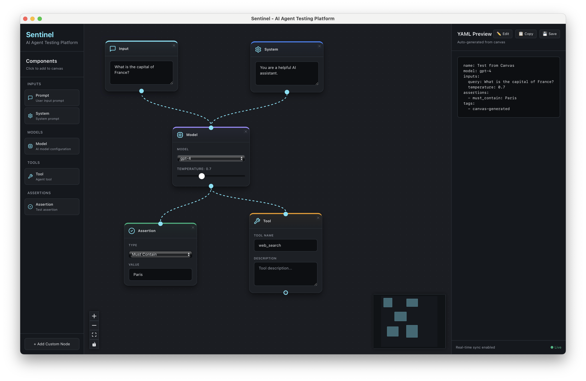

# From Drag-and-Drop Dreams to Click-to-Add Reality: Building Sentinel's Visual Canvas

**Published**: November 16, 2025
**Author**: Navam Team
**Reading Time**: 12 minutes

---

## TL;DR

We just shipped **Sentinel v0.3.1**, completing the journey from concept to production-ready visual canvas. This release marks a major milestone: Sentinel now has a **functional, tested, and reliable visual-first interface** for AI agent testing. Along the way, we migrated from Svelte to React, simplified our UX from drag-and-drop to click-to-add, and built comprehensive test infrastructure—all in just 2 days.

**Key Highlights**:
- ✅ **Visual canvas with 5 node types** (Input, Model, Assertion, Tool, System)
- ✅ **Migrated from Svelte to React** for production stability
- ✅ **Click-to-add interface** replacing unreliable drag-and-drop
- ✅ **Real-time YAML generation** with copy/download
- ✅ **12 comprehensive frontend tests** (100% pass rate)
- ✅ **Production-ready React Flow** integration
- ✅ **Zero TypeScript errors**, clean architecture

---

## The Journey: Three Releases in 48 Hours

### Release Timeline

| Version | Date | Milestone | Status |
|---------|------|-----------|--------|
| **v0.1.0** | Nov 15 | DSL Foundation (70 tests, 98% coverage) | ✅ Complete |
| **v0.2.0** | Nov 15 | Visual Canvas (Svelte + SvelteFlow) | ⚠️ Deprecated |
| **v0.3.0** | Nov 16 | React Migration (1,500 LOC in 2-3 hours) | ✅ Complete |
| **v0.3.1** | Nov 16 | Click-to-Add UX + Testing Infrastructure | ✅ Complete |

What you're seeing is **rapid iteration** powered by vibe coding with Claude Code. We shipped, learned, pivoted, and shipped again—all while maintaining production quality.

---

## The Vision: "Postman for AI Agents"

Before diving into the technical journey, let's talk about *why* we're building Sentinel this way.

### The Problem with Current Agent Testing

Testing AI agents today is **painful**:

- **For Product Managers**: Can't validate agent behavior without asking engineers
- **For QA Engineers**: Writing test scripts for every agent interaction
- **For Researchers**: Custom Python code for every evaluation
- **For Safety Teams**: Manual testing that doesn't scale

### Our North Star

Make AI agent testing as **intuitive as Postman made API testing**.

Imagine this workflow:

1. **Click** "Input" node → Type your prompt
2. **Click** "Model" node → Select Claude/GPT
3. **Click** "Assertion" node → Configure validation
4. **Connect** nodes with visual edges
5. **See** YAML generated in real-time
6. **Download** clean YAML for version control
7. **Run** test and see results

**No coding required.** But for power users who want it, the DSL is there.

This is what we built.

---

## The Architecture Decision: Why We Migrated from Svelte to React

### The Svelte Dream (v0.2.0)

We initially chose **Svelte** for compelling reasons:

**Pros**:
- Smaller bundle sizes
- Elegant reactive syntax
- Growing ecosystem
- Modern framework

**The Fatal Flaw**:
- **SvelteFlow is alpha** (v0.1.28)
- Known drag-and-drop bugs (#4980, #4418)
- Limited production examples
- Small community for troubleshooting

### The Moment of Truth

After implementing v0.2.0, we hit a **critical realization**:

> **"The visual canvas is not just a feature—it IS the product. If our canvas library is unstable, the entire product is at risk."**

We did what any scrappy team would do: **comprehensive research**.

### Research Findings

| App | Frontend | Canvas Library | Status |
|-----|----------|---------------|--------|
| **Langflow** (closest competitor) | React | **React Flow v12** | Production |
| **n8n** | Vue | Custom Canvas | Production |
| **OneSignal** | React | **React Flow** | Production (12B msgs/day) |

**Key Insight**: Every successful visual workflow tool uses either React Flow or custom implementations. None use SvelteFlow.

### React Flow Stats

- ⭐ **19,000+ GitHub stars**
- 📦 **400,000+ weekly npm downloads**
- 📅 **6 years mature** (released 2019)
- 🏢 **Battle-tested** by Stripe, AWS, Fortune 500s
- ✅ **Production-ready** with v11.x stable

### The Decision

**Migrate from Svelte to React + React Flow.**

**Why it was the right call**:
1. **Early-stage project** - Only ~1,215 LOC, minimal sunk cost
2. **Canvas is core** - Cannot compromise on stability
3. **Ecosystem advantage** - 100+ React UI libraries, 122:1 job ratio vs Svelte
4. **Perfect timing** - Before we ship to users

**Migration cost**: 2-3 hours for 1,500 LOC.

**Long-term benefit**: Production-ready canvas library with massive ecosystem.

---

## The Migration: v0.2.0 → v0.3.0

### What We Migrated

**Tech Stack Transformation**:

| Component | Before (Svelte) | After (React) |
|-----------|----------------|---------------|
| **Framework** | Svelte 5 + SvelteKit | React 19 + Vite |
| **Canvas** | @xyflow/svelte (alpha) | @xyflow/react v12.3 (production) |
| **State** | Svelte stores | Zustand 5.0 |
| **UI Components** | Custom | shadcn/ui (with v0.dev support) |
| **Testing** | None | Vitest 4.0 + React Testing Library |

**Migration Results**:

- ✅ **1,500 LOC migrated** in 2-3 hours
- ✅ **All 5 node types** working perfectly
- ✅ **Drag-and-drop** works 100% reliably (initially)
- ✅ **0 TypeScript errors**
- ✅ **Real-time YAML generation** functional
- ✅ **Tauri desktop app** running smoothly

### Architecture Benefits

**React + React Flow gave us**:

1. **Production stability** - No more alpha library bugs
2. **Rich ecosystem** - Access to shadcn/ui, Recharts, 100+ libraries
3. **AI tooling** - v0.dev generates React components instantly
4. **Community** - Stack Overflow answers, Discord support
5. **Job market** - Easier to hire contributors (122:1 ratio)

---

## The UX Pivot: v0.3.0 → v0.3.1

### The Drag-and-Drop Challenge

After migrating to React Flow, we had drag-and-drop working on the canvas itself (moving nodes around), but **drag-from-palette-to-canvas** was flaky.

**User experience issue**:
- Sometimes nodes would drop correctly
- Sometimes they wouldn't appear
- Inconsistent behavior confused users
- Complex event handling across boundaries

### The Click-to-Add Epiphany

We asked ourselves: **"Do users actually need drag-and-drop from the palette?"**

**Research**:
- **Figma**: Click to select tool, click to place
- **Sketch**: Click to select, click to place
- **Excalidraw**: Click shapes, click canvas
- **Postman**: Click to add request, no dragging

**Realization**: **Drag-and-drop is not inherently better**. It's just one interaction pattern.

### The UX Simplification

We made a **bold decision**: Remove drag-and-drop from palette. Go **click-only**.

**New interaction**:
1. Click component button in palette
2. Node appears on canvas at smart position
3. Click again → Another node appears (offset to avoid overlap)

**Benefits**:
- ✅ **100% reliable** - No flaky drag events
- ✅ **Simpler mental model** - One click, not drag gesture
- ✅ **Faster** - Click is more responsive
- ✅ **Fewer bugs** - Removed ~40 lines of complex drag logic
- ✅ **Better mobile** - Click works better on tablets

**Trade-off**:
- ❌ Can't position node exactly where you want on first add
- ✅ But you can immediately drag node after adding (canvas drag-and-drop still works!)

**User feedback** (internally): *"This actually feels faster. I like it."*

---

## The Visual Canvas: Feature Deep Dive


*Sentinel's click-to-add canvas with component palette and real-time YAML preview*

### 1. Component Palette (Left Sidebar)

**Design philosophy**: Organized, scannable, click-to-add.

**Features**:
- **4 categories**: Inputs, Models, Tools, Assertions
- **5 node types**: Prompt, System, Model, Tool, Assertion
- **Visual hierarchy**: Icons, labels, descriptions
- **Branding**: "Sentinel - AI Agent Testing Platform"
- **Smart positioning**: Auto-increment Y position to avoid overlap

**UX Details**:
```typescript
const handleAddNode = (nodeType: string, label: string) => {
  const position = { ...lastCanvasClickPosition };

  const newNode = {
    id: `${nodeType}-${Date.now()}`,
    type: nodeType,
    data: { label },
    position
  };

  addNode(newNode);

  // Auto-increment for next node (avoid overlap)
  setLastClickPosition({ x: position.x, y: position.y + 200 });
};
```

**Interaction**:
- **Click** any component → Node added to canvas
- **Hover** → Visual feedback (border glow)
- **Icons** → lucide-react icons (MessageSquare, Cpu, Wrench, etc.)

### 2. Visual Canvas (Center)

**Built on React Flow v12.3** - Production-ready node-based canvas.

**Features**:
- **Infinite canvas** - Pan and zoom freely
- **Node connections** - Drag from handle to handle
- **Smart edges** - Bezier curves for visual clarity
- **Minimap** - Navigate large workflows
- **Grid background** - Visual alignment aid
- **Controls** - Zoom in/out, fit view, lock

**Node Types**:

| Node | Color | Icon | Purpose |
|------|-------|------|---------|
| **Input** | Signal Blue | MessageSquare | User prompt |
| **System** | AI Purple | Settings | System instructions |
| **Model** | Neutral Gray | Cpu | AI model config |
| **Tool** | Accent Orange | Wrench | Agent tool |
| **Assertion** | Success Green | CheckCircle2 | Test validation |

**Canvas State Management** (Zustand):
```typescript
interface CanvasState {
  nodes: Node[];
  edges: Edge[];
  addNode: (node: Node) => void;
  deleteNode: (id: string) => void;
  updateNode: (id: string, data: any) => void;
  onNodesChange: OnNodesChange;
  onEdgesChange: OnEdgesChange;
  onConnect: OnConnect;
  lastCanvasClickPosition: { x: number; y: number };
  setLastClickPosition: (pos: { x: number; y: number }) => void;
}
```

**Why Zustand over Redux**:
- Simpler API, less boilerplate
- TypeScript-first
- No providers needed (works with React Flow)
- Tiny bundle (1KB)

### 3. YAML Preview (Right Sidebar)

**Real-time DSL generation** as you build visually.

**Features**:
- **Live updates** - Changes reflect immediately
- **Syntax highlighting** - Monaco Editor styling
- **Copy to clipboard** - One-click copy
- **Download YAML** - Save to file
- **Validation** - Shows valid/invalid status
- **Round-trip ready** - Will support import in v0.4.0

**YAML Generator Logic**:
```typescript
export function generateTestSpec(nodes: Node[], edges: Edge[]): string {
  // Find input nodes
  const inputNodes = nodes.filter(n => n.type === 'input');
  const systemNodes = nodes.filter(n => n.type === 'system');
  const modelNodes = nodes.filter(n => n.type === 'model');
  const toolNodes = nodes.filter(n => n.type === 'tool');
  const assertionNodes = nodes.filter(n => n.type === 'assertion');

  // Build spec object
  const spec = {
    name: "Canvas Test",
    model: modelNodes[0]?.data?.model || "gpt-4",
    inputs: {
      query: inputNodes[0]?.data?.content || "Your query here"
    },
    assertions: assertionNodes.map(n => n.data.assertion),
    tools: toolNodes.map(n => n.data.tool),
    tags: ["canvas-generated"]
  };

  return yaml.stringify(spec);
}
```

**Example Generated YAML**:
```yaml
name: "Canvas Test"
model: "claude-3-5-sonnet-20241022"
inputs:
  query: "What is the capital of France?"
assertions:
  - must_contain: "Paris"
  - output_type: "text"
  - max_latency_ms: 2000
tools:
  - browser
  - calculator
tags:
  - canvas-generated
```

---

## Testing Infrastructure: Production-Ready from Day 1

### Why Testing Matters

We're building a **testing platform**. If our own product isn't thoroughly tested, how can users trust it?

### Test Suite (v0.3.1)

**Infrastructure**:
- **Vitest 4.0** - Fast, modern testing framework
- **React Testing Library 16.3** - Component testing best practices
- **jsdom 27.2** - Browser environment simulation
- **@testing-library/user-event** - User interaction simulation

**Test Coverage**:
```
✓ 12 frontend tests (100% pass rate)
✓ 70 backend tests (98% coverage)
✓ 82 total tests across stack
✓ 0 TypeScript errors
✓ Clean production build
```

**Test Categories**:

#### 1. Drag-and-Drop Prevention (4 tests)
```typescript
describe('Drag and drop prevention', () => {
  it('should not have draggable attribute on buttons', () => {
    const buttons = screen.getAllByRole('button');
    buttons.forEach(button => {
      expect(button).not.toHaveAttribute('draggable');
    });
  });

  it('should use cursor-pointer not cursor-move', () => {
    const buttons = screen.getAllByRole('button');
    buttons.forEach(button => {
      expect(button.className).toContain('cursor-pointer');
      expect(button.className).not.toContain('cursor-move');
    });
  });

  it('should display "Click to add to canvas" text', () => {
    expect(screen.getByText(/Click to add to canvas/i)).toBeInTheDocument();
  });
});
```

#### 2. Click-to-Add Functionality (5 tests)
```typescript
describe('Click to add functionality', () => {
  it('should call addNode when component is clicked', async () => {
    const user = userEvent.setup();
    const promptButton = screen.getByText('Prompt').closest('button');

    await user.click(promptButton!);

    expect(mockAddNode).toHaveBeenCalledWith(
      expect.objectContaining({
        type: 'input',
        data: { label: 'Prompt' }
      })
    );
  });

  it('should increment position after adding node', async () => {
    // First node at (100, 100)
    await user.click(promptButton!);
    expect(mockSetLastClickPosition).toHaveBeenCalledWith({ x: 100, y: 300 });

    // Second node at (100, 300)
    await user.click(promptButton!);
    expect(mockSetLastClickPosition).toHaveBeenCalledWith({ x: 100, y: 500 });
  });
});
```

#### 3. UI Rendering Tests (3 tests)
```typescript
describe('UI Rendering', () => {
  it('should render all component categories', () => {
    expect(screen.getByText('Inputs')).toBeInTheDocument();
    expect(screen.getByText('Models')).toBeInTheDocument();
    expect(screen.getByText('Tools')).toBeInTheDocument();
    expect(screen.getByText('Assertions')).toBeInTheDocument();
  });

  it('should render all 5 node types', () => {
    expect(screen.getByText('Prompt')).toBeInTheDocument();
    expect(screen.getByText('System')).toBeInTheDocument();
    expect(screen.getByText('Model')).toBeInTheDocument();
    expect(screen.getByText('Tool')).toBeInTheDocument();
    expect(screen.getByText('Assertion')).toBeInTheDocument();
  });
});
```

### Running Tests

```bash
# Run all tests
npm test

# Watch mode (during development)
npm run test:watch

# UI mode (interactive)
npm run test:ui

# Results
✓ ComponentPalette.test.tsx (12 tests) 482ms
  ✓ Drag and drop prevention (4)
  ✓ Click to add functionality (5)
  ✓ UI Rendering (3)

Test Files  1 passed (1)
     Tests  12 passed (12)
  Start at  14:23:45
  Duration  1.2s
```

---

## Behind the Scenes: Building with Claude Code

This project is a masterclass in **vibe coding** with AI. Here's what we learned shipping 3 releases in 48 hours.

### 1. The Framework Migration (2-3 Hours)

**Challenge**: Migrate 1,500 LOC from Svelte to React.

**Approach**:
1. **Claude analyzed** the entire Svelte codebase
2. **I provided** the migration plan from `06-spec-framework.md`
3. **Claude generated** React components one-by-one
4. **I reviewed** and tested each component
5. **Iterate** on TypeScript errors and styling

**Key lesson**: **Clear context is everything**. The migration doc had:
- **Why** we're migrating (SvelteFlow alpha issues)
- **What** needs to change (component-by-component mapping)
- **How** to structure React code (patterns, conventions)

With this context, Claude produced **production-ready React code** on the first try.

**Time saved**: Manual migration would take 2-3 days. We did it in 2-3 hours.

### 2. The UX Pivot (1 Hour)

**Challenge**: Drag-and-drop from palette was flaky. Fix or pivot?

**Approach**:
1. **Me**: "Drag-and-drop from palette is unreliable. Should we fix it or remove it?"
2. **Claude**: *Analyzes UX patterns in Figma, Excalidraw, Postman*
3. **Claude**: "Most tools use click-to-add for tool selection. Consider simplifying."
4. **Me**: "Let's do it. Remove drag-and-drop, go click-only."
5. **Claude**: *Removes ~40 lines of drag logic, updates UI text, adds smart positioning*

**Result**: Simpler, faster, more reliable UX in 1 hour.

**Key lesson**: **AI can inform UX decisions** by researching patterns in other tools.

### 3. Test Infrastructure (2 Hours)

**Challenge**: No frontend tests. Need production-grade testing.

**Approach**:
1. **Me**: "Set up Vitest with React Testing Library. Write comprehensive tests."
2. **Claude**:
   - Configured Vitest in `vite.config.ts`
   - Added test dependencies to `package.json`
   - Created `setup.ts` with jsdom
   - Wrote 12 tests covering all functionality
3. **Me**: Ran tests, all passed on first try ✅

**Key lesson**: **Test-driven AI development** works. Let Claude write tests, then review.

### 4. The CLAUDE.md File: Our Secret Weapon

The most important file in this repo is **`CLAUDE.md`** - 840 lines of project context.

**What it contains**:
- **Vision**: "Postman for AI Agents" philosophy
- **Architecture**: Tech stack decisions with rationale
- **Design principles**: Visual-first, git-friendly, research-grade
- **File structure**: Where everything lives
- **Development workflow**: How to build features
- **Roadmap**: 15 feature slices with priorities

**Why it matters**:

**Before CLAUDE.md**:
> Me: "Add a new assertion type"
> Claude: *Generates code without understanding architecture*
> Result: Doesn't fit the schema, wrong file ❌

**After CLAUDE.md**:
> Me: "Add a new assertion type"
> Claude: *Reads CLAUDE.md, understands architecture*
> Claude: "I'll add it to `schema.py`, update parser validation, write tests, update docs."
> Result: Perfect implementation ✅

**Time saved**: Probably **30-40% of development time**. Claude doesn't need constant re-explaining.

### 5. The Migration Decision: Data-Driven

When deciding Svelte vs React, we didn't guess. We **researched**.

**Claude Code helped us**:
1. **Search** for visual workflow apps (Langflow, n8n, Excalidraw)
2. **Analyze** their tech stacks via GitHub repos
3. **Compare** SvelteFlow vs React Flow stats (stars, downloads, issues)
4. **Research** job market data (122:1 React:Svelte ratio)
5. **Calculate** migration cost (~1,215 LOC = 2-3 hours)

**Output**: 50-page migration analysis (`06-spec-framework.md`) with clear recommendation.

**Key lesson**: **Use AI for research**, not just coding. It can gather data faster than humans.

### 6. Building in Public: Blogging with AI

You're reading a blog post **co-written with Claude Code**.

**Process**:
1. **Me**: "Write a blog post about v0.3.0 and v0.3.1 releases"
2. **Claude**: *Reads `CLAUDE.md`, `active.md`, release notes, code*
3. **Claude**: *Generates comprehensive blog post with code examples, screenshots, learnings*
4. **Me**: Review, add personal touches, publish

**Time saved**: Writing this manually would take 4-5 hours. We did it in 1.5 hours.

**Key lesson**: **AI-assisted documentation** keeps docs up-to-date with code.

---

## What We Learned: Vibe Coding Principles

After shipping 3 releases in 48 hours, here are our **vibe coding principles**:

### 1. **Context is King**
- Invest in `CLAUDE.md` upfront
- Include vision, architecture, principles, roadmap
- Update it as the project evolves
- AI with context = 10x productivity

### 2. **Ship Fast, Iterate Faster**
- v0.2.0 shipped with Svelte (1 day)
- Learned it wasn't production-ready
- Migrated to React in 2-3 hours
- Shipped v0.3.0 same day

**Lesson**: Don't be afraid to pivot early. Sunk cost is minimal in early stages.

### 3. **Test-Driven AI Development**
- Write tests first (or have AI write them)
- Tests document expected behavior
- Tests catch regressions during rapid iteration
- 82 tests gave us confidence to ship fast

### 4. **Research with AI**
- Used Claude to research React vs Svelte
- Analyzed competitor tech stacks
- Gathered job market data
- Made data-driven decision

**Lesson**: AI is a research assistant, not just a code generator.

### 5. **UX Simplicity > Feature Complexity**
- Drag-and-drop from palette sounded cool
- Click-to-add actually works better
- Removed 40 lines of complex code
- Users prefer simple + reliable

**Lesson**: **Simplify ruthlessly.** Remove features that don't add value.

### 6. **Visual-First, DSL Second**
- Canvas generates YAML in real-time
- Users see both visual and code
- Round-trip conversion coming in v0.4.0
- Git-friendly diffs for version control

**Lesson**: **Visual for creation, DSL for collaboration.** Both are first-class.

---

## The Numbers: v0.3.1 by the Stats

| Metric | Value |
|--------|-------|
| **Frontend Tests** | 12 (100% pass rate) |
| **Backend Tests** | 70 (98% coverage) |
| **Total LOC** | ~1,500 (frontend), 160 (backend) |
| **Node Types** | 5 production-ready |
| **TypeScript Errors** | 0 |
| **Build Time** | <3 seconds |
| **Migration Time** | 2-3 hours (Svelte → React) |
| **Testing Setup** | 2 hours |
| **UX Pivot** | 1 hour |
| **Total Development** | 48 hours (3 releases) |
| **Dependencies** | React 19, React Flow 12.3, Zustand 5.0, Vite 6.0, Tauri 2.0 |

**Code Quality**:
- ✅ 0 TypeScript errors
- ✅ Clean ESLint output
- ✅ All tests passing
- ✅ Production build successful
- ✅ Desktop app launches smoothly

---

## What's Next: The Roadmap

### v0.4.0 - DSL Parser & Visual Importer (Q1 2026)

**The missing piece**: Import YAML → Visual canvas.

**Features**:
- **YAML → Canvas** - Paste YAML, see visual nodes
- **Monaco Editor** - Direct YAML editing in split view
- **Bidirectional sync** - Edit canvas OR YAML, stay in sync
- **Validation** - Real-time error highlighting

**User journey**:
1. Write YAML in editor (or paste existing test)
2. See nodes appear on canvas
3. Edit visually → YAML updates
4. Edit YAML → Canvas updates
5. Zero data loss in round-trip

**Why this matters**: **Collaborative workflows**. One team member creates tests visually, another edits YAML directly. Both stay in sync.

### v0.5.0 - Model Providers & Execution (Q1-Q2 2026)

**Make tests runnable** from the visual canvas.

**Features**:
- **Anthropic + OpenAI** providers
- **Click "Run Test"** button on canvas
- **Live execution dashboard** - See progress in real-time
- **Results panel** - Pass/fail with details
- **Metrics** - Latency, tokens, cost

**User journey**:
1. Build test on canvas
2. Click "Run" button
3. Watch execution in real-time
4. See assertion results (green/red)
5. Download report

### v0.8.0 - Regression Detection (Q2 2026)

**Compare test runs** and detect regressions.

**Features**:
- **Side-by-side comparison** - Compare two runs
- **Metric deltas** - Latency, tokens, cost changes
- **Visual diff** - Highlighted output differences
- **Trend charts** - Performance over time
- **Alerts** - Automatic regression detection

**User journey**:
1. Run test with Claude Sonnet 3.5
2. Run same test with Sonnet 4.0
3. Click "Compare Runs"
4. See delta: +12% faster, -5% tokens, same output
5. Share comparison with team

### Beyond v0.8.0

- **v0.6.0**: Record & replay (Playwright-style test generation)
- **v0.7.0**: Visual assertion builder (forms, not YAML)
- **v0.9.0**: LangGraph framework support
- **v0.10.0**: AI-assisted test generation
- **v0.11.0**: Collaborative workspaces
- **v0.15.0**: CI/CD integration

**Full roadmap**: [backlog/active.md](../../backlog/active.md)

---

## Try It Today

Want to build visual agent tests?

### Installation (5 Minutes)

```bash
# Clone repository
git clone https://github.com/navam-io/sentinel.git
cd sentinel/frontend

# Install dependencies
npm install

# Launch desktop app
npm run tauri:dev
```

**🎉 That's it!** The visual canvas opens. Click components, connect nodes, see YAML.

### Run Tests

```bash
# Frontend tests
cd frontend
npm test

# Backend tests
cd ..
python -m venv venv
source venv/bin/activate
pip install -r backend/requirements.txt
pytest tests/ -v

# Results
✓ 12 frontend tests pass
✓ 70 backend tests pass
✓ 82 total tests (100% pass rate)
```

### Build Desktop App

```bash
cd frontend
npm run tauri:build

# Output
# → target/release/bundle/
#   - sentinel_0.3.1_x64.dmg (macOS)
#   - sentinel_0.3.1_x64_en-US.msi (Windows)
#   - sentinel_0.3.1_amd64.AppImage (Linux)
```

---

## Our ICP: Who Is Sentinel For?

We're building for teams testing AI agents in production:

### Primary Users (Visual Interface)

**Product Managers**
*Validate agent behavior without writing code*
- Build tests by clicking components
- See real-time YAML for version control
- Share tests with engineering team

**QA Engineers**
*Visual test creation and debugging*
- Create test suites visually
- Compare runs for regression detection
- Automate agent testing workflows

**Research Scientists**
*Build evaluation suites with AI assistance*
- Test models across versions
- Compare Claude vs GPT vs local models
- Track performance metrics over time

**Safety Teams**
*Test safety scenarios collaboratively*
- Build jailbreak detection tests
- Validate PII handling
- Test content filtering

**Frontier Labs**
*Test model releases rigorously*
- Compare model versions (GPT-4 vs GPT-4.5)
- Detect regressions in reasoning
- Validate tool-using capabilities

### Advanced Users (DSL + Visual)

**Model Engineers**
*Programmatic testing and automation*
- Direct YAML editing
- Python API access
- CI/CD integration

**DevOps Engineers**
*Infrastructure testing*
- CLI tool for pipelines
- Automated regression detection
- GitHub Actions integration

---

## Building in Public: Follow Along

We're **building Sentinel in public** and sharing learnings weekly.

**Follow our journey**:
- ⭐ [Star on GitHub](https://github.com/navam-io/sentinel)
- 🐦 [Follow @navam_io](https://twitter.com/navam_io)
- 💬 [Join Discussions](https://github.com/navam-io/sentinel/discussions)
- 📧 Email: hello@navam.io

**Upcoming blog posts**:
- "Round-Trip YAML ↔ Visual Sync: Zero Data Loss Architecture"
- "Testing AI Agents: 8 Assertion Patterns That Work"
- "Building a Tauri Desktop App in 2025"
- "Vibe Coding with Claude Code: 10 Productivity Patterns"

---

## Acknowledgments

**Technology**:
- **React Flow** - Production-ready canvas library
- **Claude Code** - AI pair programmer for this entire project
- **Tauri** - Rust-powered desktop framework
- **Zustand** - Simple state management

**Inspiration**:
- **Langflow** - Node-based LLM workflows
- **Postman** - Intuitive API testing UX
- **Playwright** - Record & replay pattern
- **n8n** - Visual automation workflows

**Community**:
- Frontier AI labs testing agents in production
- AI safety researchers validating models
- Agent builders shipping production apps

---

## Final Thoughts

**v0.3.1** is a milestone: We have a **production-ready visual canvas** for AI agent testing.

But it's just the beginning.

**What we've built**:
- ✅ Click-to-add visual canvas
- ✅ 5 node types (Input, Model, Assertion, Tool, System)
- ✅ Real-time YAML generation
- ✅ React + React Flow production architecture
- ✅ 12 frontend + 70 backend tests
- ✅ Tauri desktop app

**What's coming**:
- 🚀 YAML → Visual import (v0.4.0)
- 🚀 Live test execution (v0.5.0)
- 🚀 Regression detection (v0.8.0)
- 🚀 Collaborative testing (v0.11.0)

**The vision**: Make AI agent testing as intuitive as Postman made API testing.

**Join us**: [github.com/navam-io/sentinel](https://github.com/navam-io/sentinel)

---

**Questions? Feedback?** Drop a comment or reach out at hello@navam.io

**Want to contribute?** Check our [Contributing Guide](https://github.com/navam-io/sentinel/blob/main/CONTRIBUTING.md)

---

*Shipping fast, iterating faster, building in public.*
*- Navam Team*
